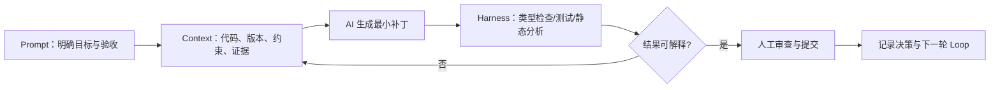

## 一句话结论

AI 的产出质量取决于可验证的上下文和反馈闭环：先给约束与证据，再让模型生成最小变更，最后用测试、审查和回归决定是否接受。

## 适用范围与前置知识

本课面向 C/嵌入式和 Linux 工程中的辅助编程，不把模型输出当作芯片手册、板级日志或运行成功证明。前置知识是 Git、编译器告警、测试和基本调试流程。

## 工程闭环图



文字降级：目标和验收 → 提供完整上下文 → 生成小补丁 → 自动检查 → 人工审查 → 记录反馈并迭代。

## 六个概念如何分工

| 概念 | 工程含义 | 常见误区 |
| --- | --- | --- |
| Prompt | 任务、限制、输入输出和验收条件 | 只说“帮我优化” |
| Context | 相关代码、版本、日志、文档和不可猜测项 | 把整个仓库无筛选塞进去 |
| Harness | 测试、lint、编译、模拟器和差异检查 | 只看模型自评 |
| Loop | 生成→验证→反馈→再生成的可重复循环 | 一次回答直接合并 |
| Skill | 固定领域流程和检查清单 | 把经验写成无边界自动操作 |
| MCP | 给模型受控的工具/数据接口 | 默认授予写入和外发权限 |

## 可复用提示词模板

```text
目标：修复 <现象>，只修改 <范围>。
上下文：目标型号/内核版本/编译器/复现日志/相关文件：<证据>。
约束：不得猜测寄存器、地址或工具链行为；未运行的代码不得声称成功。
输出：先列假设，再给最小补丁、测试命令、未验证项和回滚方法。
验收：<具体命令和人工截图检查项>。
```

## 调试方法、反例与安全边界

1. 把模型的每个关键结论映射到文件、文档章节、日志行或测试结果。
2. 让 Harness 先运行类型检查、lint、单元测试和构建，再让模型解释失败。
3. 对板级代码要求型号、资料版本和日志证据；对网络工具明确只读范围和脱敏规则。

反例：让 AI “补全 STM32 启动地址”后直接烧录；把通过一次测试说成所有芯片都兼容；把 MCP 工具权限设为任意写文件和外发数据。

## 30 秒回答与展开回答

30 秒回答：Prompt 定义目标，Context 提供证据，Harness 自动验证，Loop 通过反馈迭代，Skill 固化领域流程，MCP 以受控接口提供工具。AI 只能加速推理和改写，不能替代编译、测试、资料核对和人工决策。

展开回答：先把任务拆成可验收的小步，固定版本和证据边界，要求模型输出最小补丁与验证命令；Harness 执行后把失败原样反馈，人工检查差异、权限和安全影响，最后再提交并记录未验证项。

## 递进追问

1. AI 生成的驱动补丁能通过单元测试但没有真板日志，你会如何表述它的完成度？
2. 如何设计一个只读 MCP 工具，使模型能查资料但不能修改用户代码或外发隐私？

## 自测与主动回忆

- 自测：把“修复一个偶发 UART 丢字节问题”改写成包含目标、上下文、约束、Harness 和验收的提示词。
- 主动回忆：不看页面解释六个概念的先后关系，并举出一个“模型说对但仍不能合并”的证据缺口。

## 来源和证据边界

提示词结构参考 OpenAI 工程指南；编译器和调试工具行为仍以对应版本文档为准。本课没有声称任何 AI 自动修改已经在目标硬件上运行成功，也不提供运行时语音或录音功能。
