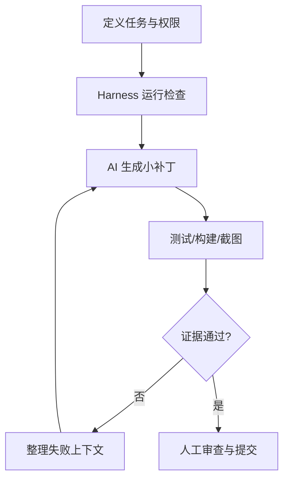

## 一句话结论

Harness 是工具、测试和权限的执行边界，Loop 是“计划—修改—验证—反馈”的循环，Skill 是可复用流程，MCP 是工具连接协议；四者都不能替代人工授权和证据审查。

## 适用范围与前置知识

适用于本地代码库、内容库和测试驱动的 AI 协作。前置知识是版本控制、命令行测试和最小权限原则；不同 AI 客户端的 Skill/MCP 实现需要按其文档核对。

## 工程闭环图



文字降级：先限制工具和目录，再让 AI 小步修改；每轮都运行真实检查，只有人工看过 diff 和证据才提交。

## 核心配置原则

```text
允许：读取源码、运行 lint/test/build、写入指定目录
默认拒绝：网络发布、删除数据、修改测试断言、访问凭据
每轮输出：变更文件、命令、结果、截图路径、未证实假设
```

MCP 工具应按只读、可写、外部副作用分层授权；Skill 文档要写输入、输出、失败处理和回滚方式。Harness 记录命令和环境，避免“本地成功”无法复现。

## 调试方法

1. 先用只读 Harness 检索相关文件，确认范围后再开放指定写入路径。
2. 把失败测试、浏览器截图和日志压缩成下一轮最小 Context。
3. 对 AI 生成的代码运行格式、类型、单元、构建和关键页面人工验收。
4. 检查工具调用记录，确认没有越权网络请求、凭据泄露或隐式删除。

反例：给 MCP 全仓库写权限；Skill 只写“自动修复”没有验收；Loop 只重复生成不读取失败证据；把一次通过当作长期正确。

## 30 秒回答与展开回答

30 秒回答：Harness 控制工具和权限，Loop 管理反馈循环，Skill 固化流程，MCP 连接外部工具。AI 修改必须小步、可回滚，并通过真实测试、截图和人工 diff 审查。

展开回答：我会从只读检索开始，明确允许目录和命令，再开放最小写权限。每轮保留环境、输出和失败原因，涉及发布、删除或隐私数据时必须停下来人工确认。

## 递进追问

1. 如何设计一个只允许运行测试、不允许网络访问的 Harness？
2. 当测试通过但截图显示布局错误时，Loop 的下一轮 Context 应包含什么？

## 自测与主动回忆

- 自测：为“新增一篇课程并生成测试题”设计权限表、验收命令和回滚点。
- 主动回忆：不用看页面解释 Harness、Loop、Skill、MCP 的边界。

## 来源和证据边界

流程中的提示词、评估和工具约束参考 AI Engineering Guidance；MCP/Skill 的具体协议和权限模型以实际客户端版本文档为准，不把概念名当作统一标准实现。
