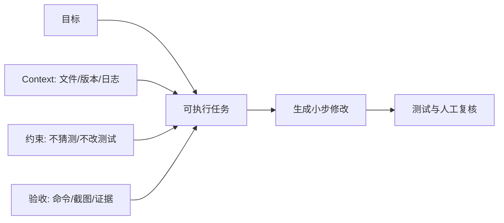

## 一句话结论

高质量 AI 编程请求要同时给出目标、仓库上下文、约束、证据要求和验收命令；Context 不是越多越好，而是要保留能改变决策的事实。

## 适用范围与前置知识

适用于个人嵌入式学习、代码阅读和小型修改，不把模型输出当作未经验证的事实。前置知识是能运行项目测试、阅读编译错误并识别目标平台边界。

## 请求结构图



文字降级：先给事实和边界，再给任务与验收；让 AI 每次只改一小步，并要求它报告证据和未完成项。

## Prompt 模板

```text
目标：在 <文件/模块> 中实现 <行为>。
已知事实：<版本、现有接口、日志、资料来源>。
约束：不修改测试断言；不猜测板级参数；保留用户改动。
验收：运行 <命令>，并用 <截图/日志/人工检查> 证明。
输出：先说明假设，再给补丁、测试结果和剩余风险。
```

Context 应优先包括接口定义、失败日志、相关测试和版本信息；与任务无关的大段文档会稀释注意力，反而提高误解概率。

## 调试方法

1. 让 AI 先复述目标和不确定性，发现它把日志观察写成硬件事实时立即纠正。
2. 每轮只提交一个可回滚的变更，保存 diff 和测试输出。
3. 将模型建议与官方文档、现有代码和真实日志三方对照。
4. 用失败测试作为下一轮 Context，而不是只说“还是不对”。

反例：只输入“帮我优化这个项目”；把整个仓库无筛选地塞进上下文；接受没有命令和证据的“已修复”。

## 30 秒回答与展开回答

30 秒回答：Prompt 应包含目标、事实、约束和验收，Context 只保留影响决策的信息。AI 输出必须通过测试、文档和人工复核，不能把生成结果当证据。

展开回答：我会先让模型列假设和未知，再分小步修改。每轮保留 diff、命令、截图和剩余风险，尤其对芯片型号、DTS、启动偏移等板级结论要求来源绑定。

## 递进追问

1. 什么时候应该减少 Context，而不是继续追加文件？
2. 如何把一个模糊需求拆成可以被单元测试和截图分别验收的任务？

## 自测与主动回忆

- 自测：把“增加一个 Linux 驱动专题”改写成包含目标、约束和验收命令的 Prompt。
- 主动回忆：复述 Prompt 的目标、事实、约束、验收四个槽位。

## 来源和证据边界

提示词结构和评估闭环参考 OpenAI Prompt Engineering Guide；具体模型能力、上下文上限和工具权限取决于实际产品配置，不能从模板推断。
