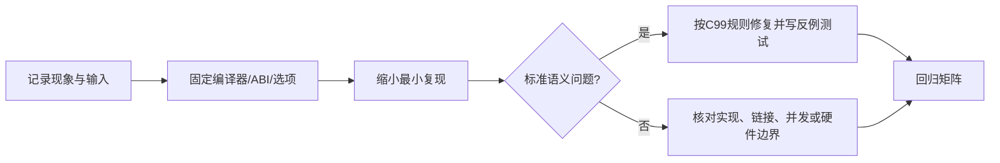

## 调试目标

企业代码中的“偶发崩溃”通常不是从调试器开始，而是从把问题分类开始：这是标准 C 语义问题、编译器实现差异、链接布局问题，还是目标平台的并发与硬件问题？如果分类错误，换优化级别或加日志只能改变现象，不能证明修复成立。

## 四层排查法

1. **先让编译器说话**：记录编译器、目标三元组、语言标准和完整告警选项。主机练习可以从 `-std=c99 -Wall -Wextra -Wpedantic -Wconversion -Wshadow -g3 -O0` 开始；这些是工具链选项，不是标准 C 的保证。
2. **缩小到最小复现**：删除业务模块、线程、外设和日志，只保留能稳定触发问题的输入、状态转移和一条失败断言。
3. **区分未定义行为**：越界、悬空指针、错误的生命周期和不满足约束的类型转换不能用“一次运行没出错”证明安全。按照 C 标准判断，不能把某个 GCC 版本的结果当成语言规则。
4. **对比构建矩阵**：至少记录 `-O0` 与发布优化、主机与交叉编译器、32 位与 64 位 ABI 的差异。差异是定位线索，不是修复证据。

## 结果记录模板

```text
现象：
触发输入：
最小复现：
编译器/版本/目标：
标准与告警选项：
观察点：
假设：
反例或排除实验：
修复：
回归用例：
```

## 边界

本课只核验标准 C 和编译器诊断的分层方法，不声称某个编译器已经运行了本课示例，也不把 `volatile` 当作线程同步原语。涉及 ISR、缓存、DMA 或 RTOS 调度时，必须转到对应架构和实现层继续核验。

## 一句话结论

有效的 C 修复必须同时有固定环境的最小复现、针对反例的测试和可复核的回归结果；改变优化级别或日志文本只能改变现象，不能单独证明修复。

## 适用范围与前置知识

- 适用：C99 语义、GCC 诊断和主机侧最小复现。
- 不适用：把主机告警或浏览器 runner 结果外推为 Cortex-M、RT-Thread 或具体板卡验证。
- 前置：C 指针与生命周期、基本 Make/GDB 使用。

## 调试分层流程图（Mermaid 失败时的文字降级）



文字步骤：记录 → 固定环境 → 缩小复现 → 分类标准/实现/平台边界 → 修复并保留反例 → 在构建矩阵中回归。

## 核心代码、日志与反例

```c
#include <stddef.h>

static int first_or_error(const int *values, size_t count)
{
    if (values == NULL || count == 0) {
        return -1;
    }
    return values[0];
}
```

最小报告日志应包含：`compiler=... target=... std=c99 opt=... input=... result=...`。反例是只在 `-O0` 下运行一次没有崩溃，或删掉一条日志后现象消失；二者都没有覆盖真实根因。

## 调试步骤

1. 先保存编译器版本、目标三元组、完整告警和链接参数。
2. 用一条输入和一个断言复现，删除无关线程、外设和日志。
3. 对比 `-O0`/发布优化、主机/交叉工具链，并保留每次结果。
4. 修复后运行原始复现、边界输入和回归测试，记录未运行的目标板实验为 `not-run`。

## 30 秒回答与展开回答

30 秒回答：先分类，再固定环境并做最小复现；修复必须通过反例和回归矩阵，不能用一次运行或日志变化作证据。

展开回答：把标准 C、编译器实现、链接布局和目标并发/硬件分别记录，使用与产物匹配的符号和参数复核。只有实际运行过的对象才能标记为 host-compiled、target-compiled 或 hardware-tested。

递进追问：

1. 为什么把 `-Werror` 加上就不等于消除了未定义行为？
2. 如何设计一个能区分悬空指针和数据竞争的最小复现？

## 自测与主动回忆入口

- 自测：给出“优化后偶发崩溃”的日志，写出至少两个互斥假设和各自的最小验证。
- 主动回忆：合上页面复述“记录—固定—缩小—分类—反例—回归”六步，并按是否覆盖证据链自评。

## 来源与证据边界

N1256 约束标准 C 语义，GCC warning options 约束诊断选项；没有具体目标工具链和运行日志时，本课只提供分析方法，不声称目标板验证。
