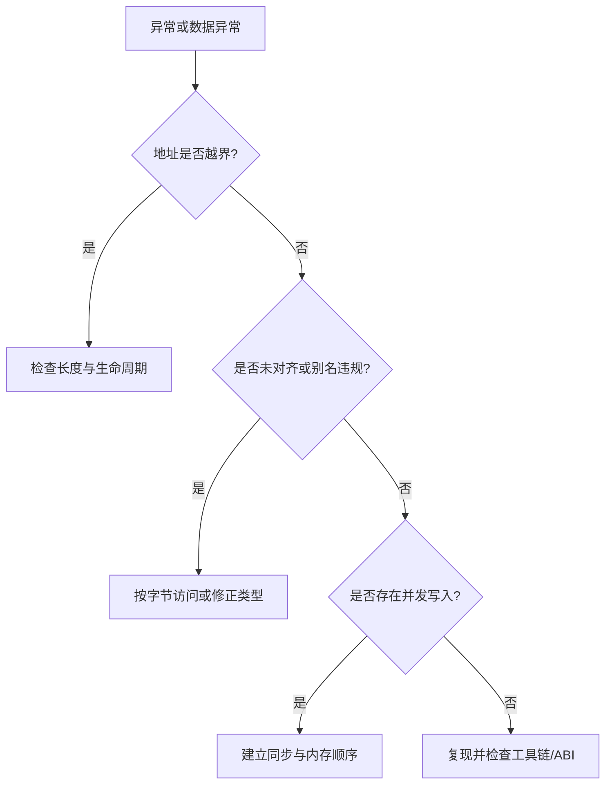

## 一句话结论

排查内存问题要先区分生命周期、边界、对齐、别名和数据竞争；“在某次编译中能运行”不是 C 语义保证。

## 适用范围与前置知识

适用于 C99 程序和 ARM 裸机/RTOS 常见内存模型。前置知识是指针、存储期和基本链接概念；栈大小、堆分配器和 MPU 属性属于目标平台配置。

## 定位流程图



文字降级：先锁定地址和边界，再检查对象是否仍存活、访问是否满足对齐和别名规则，最后排查并发与工具链差异。

## 核心代码与日志

```c
static int copy_payload(uint8_t *dst, size_t dst_size,
                        const uint8_t *src, size_t src_size)
{
    if (dst == NULL || src == NULL || src_size > dst_size) return -1;
    memcpy(dst, src, src_size);
    return 0;
}
```

故障日志至少包含：PC、LR、栈指针、访问地址、缓冲区起止、线程/中断上下文和构建版本。未在特定芯片上运行时，不把地址映射写成实测结果。

## 调试方法

1. 使用 AddressSanitizer/UndefinedBehaviorSanitizer（目标环境允许时）复现用户态版本。
2. 裸机侧在关键缓冲区两端放哨兵，记录栈高水位和分配失败次数。
3. 用 `-fsanitize` 或高告警构建验证最小复现，再回到交叉编译器确认差异。
4. 检查整数溢出、移位位数、悬空指针、重复释放和严格别名违规。

反例：通过增加数组大小掩盖越界；看到 HardFault 就只改栈大小；用 `volatile`“修复”数据竞争。

## 30 秒回答与展开回答

30 秒回答：内存异常不能只看症状。先保存现场和地址，再按边界/生命周期、对齐/别名、并发和工具链四层缩小范围，使用最小复现和运行时工具证明根因。

展开回答：C 对越界、悬空、非法移位等行为不作保证，编译器可以据此优化。嵌入式工程还要把链接脚本的段布局、栈堆边界和中断上下文纳入证据链，不能用“偶尔正常”作为结论。

## 递进追问

1. 为什么未定义行为可能在打开优化后才出现，调试版却看不出来？
2. 如何区分栈溢出、DMA 越界和线程竞争造成的同一条错误日志？

## 自测与主动回忆

- 自测：列出至少五类 C 未定义行为，并为其中两类写出最小的防护断言。
- 主动回忆：合上页面从 PC、地址、边界、生命周期、并发五个证据点复述定位流程。

## 来源和证据边界

C99 语义和未定义行为边界来自 WG14 N1256，告警选项来自 GCC 文档。Sanitizer 和链接脚本属于工具链/平台能力，使用时要记录版本和实际命令。
