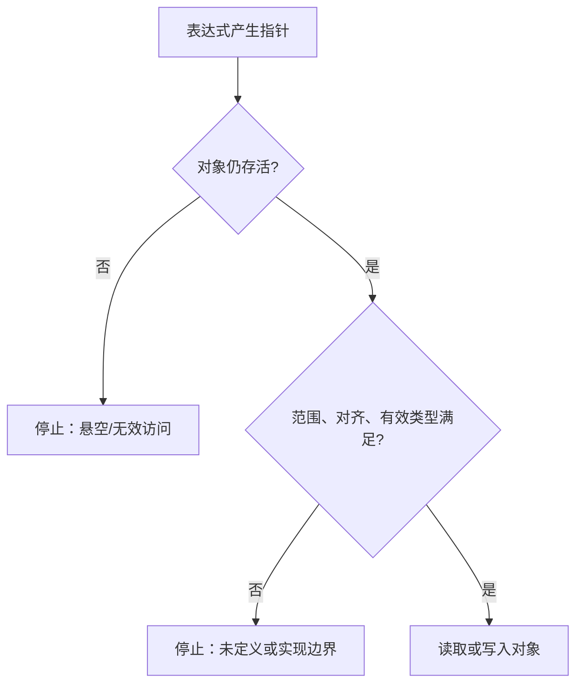

## 学习目标

区分对象、存储期、对齐、生命周期和未定义行为。本文是通用 C 基础，不把编译器扩展或具体 MCU 地址当成标准 C 结论。

## 核心结论

先描述标准语义，再标明 GCC、编译器选项和目标 ABI。未运行的代码只作为分析题，不标记为已验证实验。

## 最小练习

分析一个指针是否仍指向有效对象，并说明判断还依赖哪些编译参数、ABI 或目标平台资料；缺少证据的部分直接写成假设，不影响先学习标准 C 的确定语义。

## 一句话结论

C99 的可靠推理顺序是对象与存储期 → 有效访问范围 → 对齐与有效类型 → 编译器/ABI 约束；一次运行结果不能替代这条证据链。

## 适用范围与前置知识

- 适用：WG14 N1256 的标准 C 语义，以及主机 GCC 的诊断练习。
- 不适用：把 GCC 扩展、链接脚本、内存映射寄存器或线程同步行为当作标准 C 保证。
- 前置：基本类型、指针、函数调用和基础编译命令。

## 对象访问流程图（Mermaid 失败时的文字降级）



文字步骤：先找出指针指向的对象和存储期，再确认索引、对齐和有效类型，最后才讨论读取结果。任何一步缺少证据，都只能记录为假设。

## 核心代码与调试方法

```c
#include <stddef.h>

int copy_first(const int *src, size_t count, int *dst)
{
    if (src == NULL || dst == NULL || count == 0) {
        return -1;
    }
    *dst = src[0];
    return 0;
}
```

主机练习命令：`gcc -std=c99 -Wall -Wextra -Wpedantic -g3 -O0`。调试时记录编译器版本、目标三元组、优化等级、输入和最小复现；需要 AddressSanitizer 时必须注明它是工具链诊断，不是 C99 语义证明。

反例：函数返回局部数组首元素地址后“偶尔还能打印”，对象存储期已经结束，`-O0` 也不会使访问重新获得标准语义。

## 30 秒回答与展开回答

30 秒回答：先确认对象是否存活，再确认访问范围、对齐和有效类型，最后区分标准语义与编译器/ABI 实现；偶然输出正确不能证明安全。

展开回答：把问题缩小到一个对象和一个索引，记录编译矩阵和告警，再用反例测试验证生命周期、别名和边界假设。涉及并发、DMA 或寄存器时转到对应平台资料。

递进追问：

1. 为什么 `volatile` 不能替代线程同步或原子性？
2. `-O0` 与 `-O2` 出现不同结果时，如何判断是未定义行为还是实现差异？

## 自测与主动回忆入口

- 自测：给出一个数组指针和一个函数返回值，标出对象存储期、可访问范围和仍缺少的证据。
- 主动回忆：合上页面，用“生命周期—范围—对齐—有效类型—工具链边界”五点解释一次指针访问，并选择忘记、困难、掌握或简单。

## 来源与证据边界

N1256 支撑本课的 C99 语义；GCC 参数只说明主机诊断方式。没有具体 MCU 料号、ABI、链接脚本或真实日志时，不给出板级结论。
