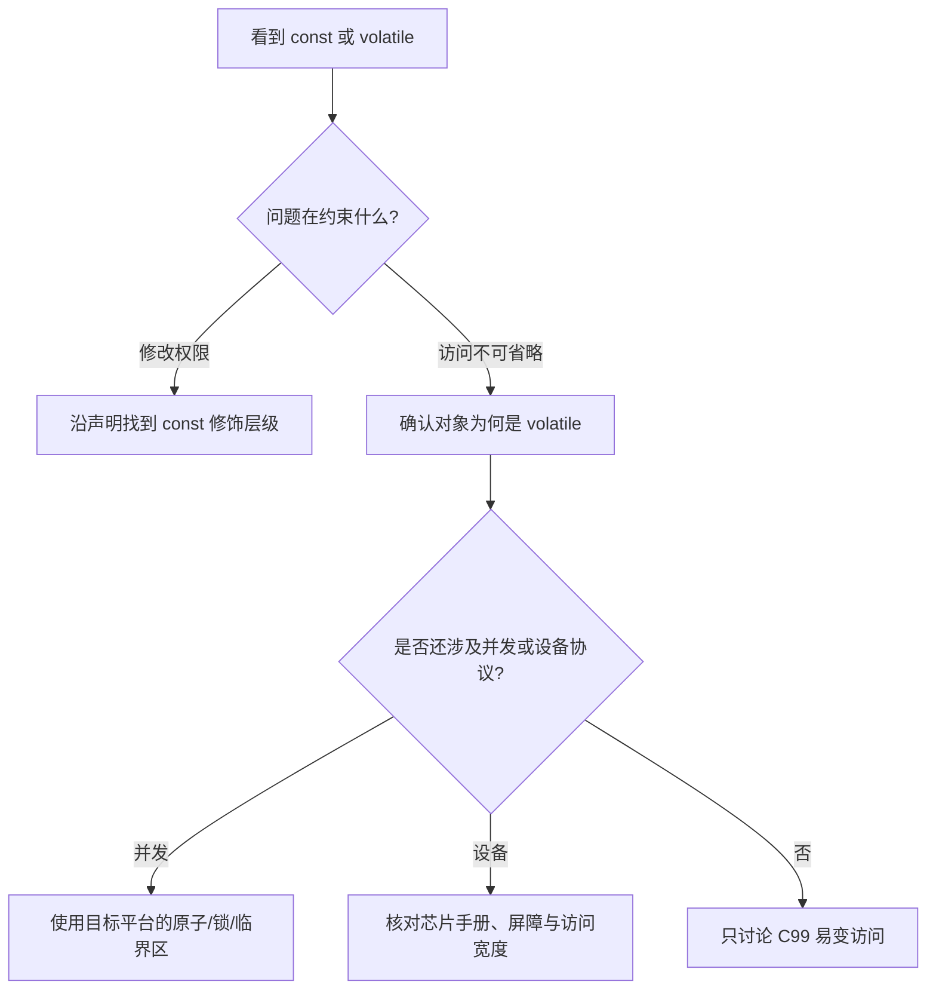

## 一句话结论

`const` 约束通过某个左值修改对象，`volatile` 约束实现不得随意消除对应访问；二者都不提供原子性、锁、跨线程 happens-before 或完整的设备访问协议。

## 适用范围与前置知识

- 适用：C99 类型限定符、指针声明、优化边界，以及 Cortex-M3 项目中常见的寄存器/中断共享变量辨析。
- 不适用：把 `volatile` 当成 RTOS 同步原语，或仅凭 C 语法推断某个外设寄存器的读写副作用。
- 前置：指针、对象生命周期、表达式求值和编译器优化的基本概念。

## 先读懂声明

| 声明 | 能否改 `*p` | 能否改 `p` | 常见用途 |
| --- | --- | --- | --- |
| `const int *p` | 不能通过 `p` 改 | 能 | 只读视图 |
| `int * const p` | 能 | 不能 | 固定目标指针 |
| `const int * const p` | 不能 | 不能 | 固定的只读视图 |
| `volatile uint32_t *p` | 能，每次访问受 volatile 规则约束 | 能 | 实现定义的易变对象访问 |

`const` 不等于“对象物理上永远不变”。同一个非 const 对象可以同时被普通指针和指向 const 的指针引用；前者仍可修改对象。反过来，强制去掉一个原本就定义为 const 的对象的限定并写入，行为未定义。

## 判断流程图



文字降级：先判断限定符修饰对象还是指针，再判断问题属于编译器访问、并发同步还是硬件协议；后两类必须继续查平台资料，不能停在 `volatile`。

## volatile 保证了什么

在 C 抽象机中，对 volatile 对象的访问属于需要被实现认真对待的可观察行为，但“在什么时刻完成、能否拆分、与其他地址如何排序”还受实现和目标平台约束。它通常用于编译器无法从普通控制流推断会变化的对象，但不自动提供：

- 复合表达式的原子性，例如 `counter++` 仍包含读、改、写。
- 多核或多线程同步，以及内存顺序。
- 临界区保护、优先级继承或等待唤醒。
- 外设要求的访问宽度、先后顺序、读清零和写一清零语义。

## 核心代码

```c
#include <stdint.h>

static volatile uint32_t event_pending;

void on_event_from_isr(void)
{
    event_pending = 1U;
}

uint32_t poll_event(void)
{
    uint32_t observed = event_pending;
    if (observed != 0U) {
        event_pending = 0U;
    }
    return observed;
}
```

这段代码只展示 volatile 访问形态，**没有证明**读清过程不会与中断写入竞争。是否需要关中断、原子操作、事件对象或其他协议，要结合目标 Cortex-M3、编译器、RTOS 和业务丢事件容忍度判断；本示例未在 STM32F103C8T6 上运行。

## 调试方法

1. 从变量定义追到所有读写者，标出线程、中断、DMA 和外设四类主体。
2. 区分“编译器没有执行一次访问”“访问被竞争覆盖”“设备没有按预期响应”三个假设。
3. 保存优化级别、反汇编和可复现输入；反汇编只能说明生成了什么指令，不能单独证明并发协议正确。
4. 涉及寄存器时核对具体料号参考手册中的访问宽度、读写副作用和屏障要求。

## 反例

- 给共享计数器加 `volatile` 后继续执行 `counter++`，并宣称不会丢计数。
- 把函数参数改成 `const`，就宣称底层对象不会被其他模块修改。
- 看到反汇编里存在一条 load/store，就断言外设事务和总线时序已经正确。

## 30 秒回答

`const` 解决接口上的修改权限，`volatile` 解决实现不能把特定访问当普通不变值随意优化的问题。`volatile` 不保证原子性和线程同步；中断共享、DMA 和寄存器访问仍要用目标平台的临界区、原子机制、屏障和芯片手册建立证据。

## 展开回答

先沿声明判断限定的是对象还是指针。再判断变化来源：普通代码只需遵守类型和生命周期；并发需要同步协议；内存映射 I/O 需要实现和芯片手册共同定义访问。对 `volatile` 变量做复合读改写仍可能竞争，因此要把读者、写者、中断窗口和丢失更新逐项画出来。

## 递进追问

1. `const int *p` 与 `int * const p` 分别限制什么，为什么都不能证明对象绝对不变？
2. 主循环清零标志的同时 ISR 再次置位，事件为什么可能丢失，怎样按需求改成计数、临界区或 RTOS 事件？

## 自测与主动回忆入口

- 自测：为四种 const 指针声明分别写出允许和禁止的赋值，再解释 `volatile uint32_t counter++` 为什么仍可能竞争。
- 主动回忆：合上页面，用“修改权限、易变访问、原子性、同步、设备协议”五个词复述边界，并给自己标记熟悉、模糊或不会。

## 来源和证据边界

C99 类型限定符语义来自 WG14 N1256；GCC 告警只作为诊断入口；Cortex-M3 文档用于架构背景。没有绑定 STM32F103C8T6 参考手册章节、具体工具链和真板观察时，不给出某个寄存器或屏障的运行结论。
