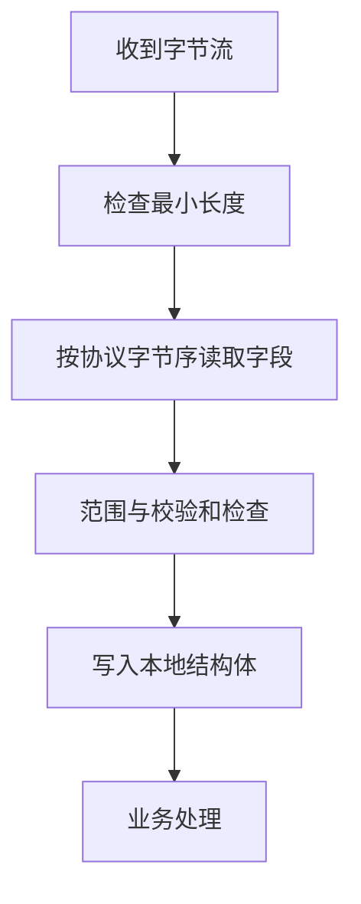

## 一句话结论

结构体成员顺序和对齐由实现决定，联合体同一时刻只应按当前有效成员解释；跨设备协议必须显式序列化字段和字节序，不能直接发送结构体内存。

## 适用范围与前置知识

适用于 C99 数据对象和常见 ARM GCC 工程。前置知识是整数类型、指针和缓冲区边界；具体 ABI 的对齐规则要查编译器文档或用 `sizeof`、`_Alignof` 实测。

## 解析流程图



文字降级：字节流先按协议定义解析，再填入本地对象；不要用强制类型转换跳过长度、对齐和字节序检查。

## 核心代码

```c
static uint16_t read_le16(const uint8_t bytes[2])
{
    return (uint16_t)bytes[0] | ((uint16_t)bytes[1] << 8);
}

struct sample {
    uint8_t type;
    uint32_t value;
};
```

`struct sample` 可能包含填充字节；位域的分配方向、跨字节布局和可取地址性也由实现决定。`memcpy` 可避免未对齐强转，但仍不能替代协议字节序解析。

## 调试方法

1. 打印 `sizeof`、`_Alignof` 和每个成员的偏移，记录编译器、目标架构和编译选项。
2. 对协议抓包逐字节比对，不要只打印解析后的十进制值。
3. 用全 0、全 1、边界值和故意错误校验和测试联合体/位域替代方案。
4. 开启 `-Wpadded`（若编译器支持）观察意外填充，并明确是否允许使用 `packed` 扩展。

反例：`send(fd, &packet, sizeof(packet), 0)` 直接发送结构体；用位域定义网络帧；用 `#pragma pack` 后不考虑未对齐访问代价。

## 30 秒回答与展开回答

30 秒回答：结构体布局、位域顺序和填充不是可移植协议格式。协议数据应该按字段宽度和大小端显式编码，解析后再存入结构体，并用抓包和偏移信息验证。

展开回答：联合体可用于实现相关的对象表示检查，但读取非当前有效成员存在实现边界。嵌入式中应区分“本地内存布局”和“线上字节布局”，必要时用 `memcpy` 与移位组合避免对齐和别名问题。

## 递进追问

1. `packed` 结构体为什么可能导致 Cortex-M 上的未对齐访问异常或性能下降？
2. 如何设计一个同时支持大端和小端设备的寄存器镜像或通信协议？

## 自测与主动回忆

- 自测：给出两个字节 `0x34 0x12`，分别写出小端和大端解析结果，并说明为什么不能用结构体强转代替。
- 主动回忆：复述“填充、对齐、位域、大小端、序列化”五个词各自解决什么问题。

## 来源和证据边界

C99 对结构体、联合体和对象表示的约束来自 WG14 N1256。具体 ARM ABI、编译器 `packed` 行为和未对齐陷阱必须绑定实际工具链验证。
