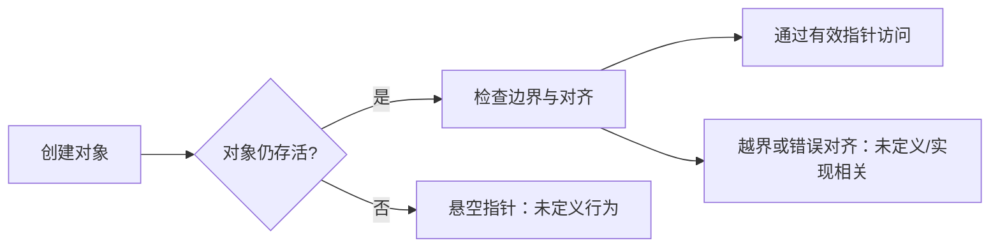

## 一句话结论

在 C99 中，指针只有在仍指向存活且可访问的对象、索引未越界并满足对齐要求时才有可靠语义；一次“正常输出”不是安全证明。

## 适用范围与前置知识

- 适用：ISO C99（WG14 N1256）语义，以及主机 GCC 的诊断示例。
- 不适用：将 GCC 扩展、目标 ABI、MCU 内存映射寄存器或 RTOS 同步语义当成 C99 保证。
- 前置：基本类型、表达式、函数调用和编译器告警。

## 关系图（Mermaid 失败时的文字降级）



文字步骤：创建对象 → 确认存储期仍在 → 确认索引和对齐 → 访问；任一步缺少证据就不能把运行结果当作结论。

## 核心代码（static-reviewed，未在目标板运行）

```c
#include <stddef.h>

static int read_first(const int *values, size_t count, int *out)
{
    if (values == NULL || out == NULL || count == 0) {
        return -1;
    }
    *out = values[0];
    return 0;
}
```

主机检查命令：`gcc -std=c99 -Wall -Wextra -Wpedantic -g3 -O0`。这只说明该工具链的静态诊断结果，不代表任意 ABI 或硬件验证。

## 调试方法、反例与限制

1. 保存编译器版本、目标三元组、语言标准、告警和优化选项。
2. 把输入缩小为一个对象、一个索引和一个释放/返回路径。
3. 用 GDB watchpoint 或工具链支持的 AddressSanitizer 寻找越界线索，再回到 C99 语义判断。
4. 反例：返回局部数组地址后“偶尔打印正确”，仍是悬空指针；`-O0` 不会把它变安全。

## 30 秒回答与展开回答

30 秒回答：先检查对象生命周期，再检查边界和对齐，最后说明标准 C 与编译器/ABI 的边界；一次运行结果不能证明安全。

展开回答：区分存储期、有效类型、指针算术可达范围以及实现定义行为；保留最小复现和编译矩阵；用反例和回归测试确认修复。

递进追问：

1. 为什么 `volatile` 不能替代线程同步？
2. `-O0` 与 `-O2` 表现不同，如何区分未定义行为和实现差异？

## 自测与主动回忆入口

- 自测：给出一个指针访问例子，标出对象存储期、边界检查和仍缺少的证据。
- 主动回忆：合上页面，用 30 秒回答“什么条件下指针访问才有 C99 语义依据”，按“生命周期—边界—对齐—验证”四个评分点选择忘记、困难、掌握或简单。

## 来源与证据边界

N1256 只支撑 C99 标准语义；GCC 参数属于工具链资料。没有具体 MCU 料号、ABI、链接脚本或真实运行日志时，不给出板级结论。
