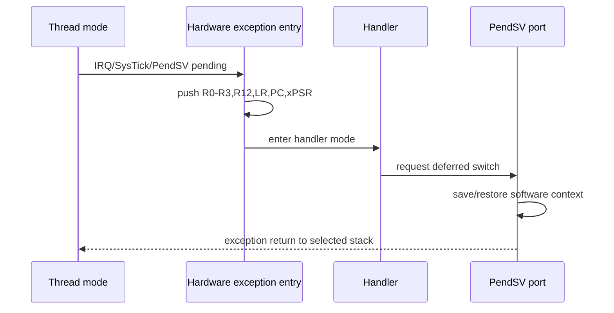

## 分层边界

Cortex-M 异常入口、自动压栈和 PendSV 是架构层内容；具体启动文件、向量表地址和芯片外设仍需回到 MCU 官方手册。

## 学习路径

从异常模型进入 RTOS 上下文切换，再阅读对应 RT-Thread `libcpu` 端口。不能仅凭 RTOS API 推断汇编行为。

## 实验状态

当前只提供栈帧推演和代码阅读题，未宣称在任何实际芯片上运行。

## 一句话结论

Cortex-M 异常入口会保存一组基本寄存器现场，具体使用 MSP/PSP、异常返回标记和 PendSV 上下文切换则必须结合架构手册与具体 port 实现判断。

## 适用范围与前置知识

- 适用：Cortex-M3/M4 通用异常模型、NVIC、SysTick/PendSV 和基本栈帧。
- 不适用：把异常号、向量表地址、FPU 扩展帧或中断屏蔽值外推到 ESP32、Cortex-A 或未声明的芯片。
- 前置：C 指针、函数调用、栈和 RTOS 线程状态。

## 异常与上下文切换时序图（Mermaid 失败时的文字降级）



文字步骤：线程运行 → 异常挂起 → 硬件压入基本帧 → Handler 记录原因 → PendSV 延后保存/恢复上下文 → 异常返回。FPU 扩展帧和栈对齐必须按具体配置检查。

## 核心代码与现场日志

```c
typedef struct {
    unsigned long r0, r1, r2, r3, r12;
    unsigned long lr, pc, xpsr;
} exception_frame_t;

static void inspect_frame(const exception_frame_t *frame)
{
    /* 仅用于静态阅读；不要在未保存现场前执行复杂逻辑。 */
    log_word("pc", frame->pc);
    log_word("lr", frame->lr);
}
```

现场记录模板：`ipsr=... exc_return=... msp=... psp=... pc=... lr=... xpsr=...`。该代码和日志格式未在具体 MCU 上运行，不能标记为硬件验证。

## 调试步骤、反例与限制

1. 保存与固件匹配的 ELF、Map、启动文件、编译选项和架构手册版本。
2. 在 Handler 入口先复制 MSP/PSP、`EXC_RETURN` 和基本栈帧，再判断来源线程。
3. 对照 port 汇编确认 PendSV 保存了哪些软件寄存器，记录屏蔽中断和调度点。
4. 反例：因为一个 RTOS 使用 PendSV，就断言所有 Cortex-M 或所有 RTOS 都有相同优先级和栈帧。

## 30 秒回答与展开回答

30 秒回答：异常入口由硬件保存基本帧，Handler 根据 `EXC_RETURN` 判断栈来源；PendSV 通常把上下文切换延后执行，但寄存器集合和优先级属于具体 port 配置。

展开回答：先分离架构保证、CMSIS 接口和 RTOS 汇编实现，再用异常现场、ELF/Map 和 port 源码闭合证据链，不能只凭 API 名称推导行为。

递进追问：

1. Cortex-M4F 的浮点扩展帧何时出现，如何从 `EXC_RETURN` 判断？
2. 为什么 SysTick 适合产生节拍，而 PendSV 更适合执行延后的上下文切换？

## 自测与主动回忆入口

- 自测：给出一组 `PC/LR/xPSR/MSP/PSP/EXC_RETURN`，写出现场来源和仍需查阅的 port 证据。
- 主动回忆：合上页面复述“挂起—压栈—Handler—PendSV—异常返回”五步，并选择忘记、困难、掌握或简单。

## 来源与证据边界

Arm Cortex-M3/M4 Generic User Guide 支撑架构级异常模型；CMSIS 和具体 RTOS port 决定工程实现。没有完整 MCU 料号、启动文件和 port 代码时，不给出地址或寄存器配置结论。
