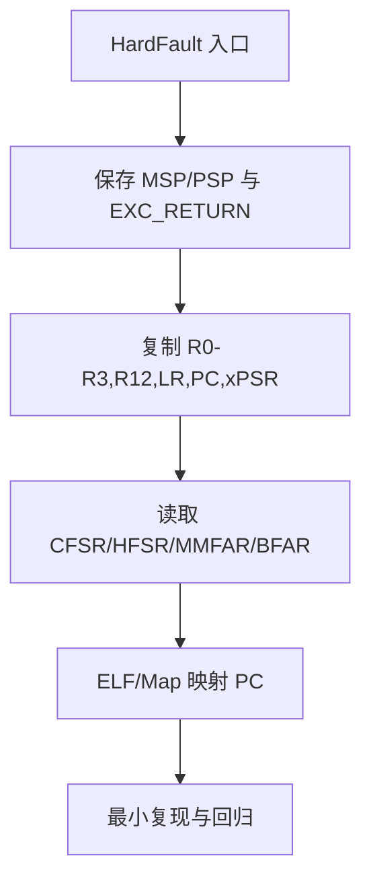

## 先保留现场

HardFault 不是根因名称，而是需要继续解码的异常入口。第一步不是重启，而是保存异常发生时的栈指针、异常返回标记和可用的故障状态寄存器。调试固件应避免在异常处理函数里进行复杂分配、阻塞等待或大量格式化输出。

## 分层理解

- **架构通用层**：异常进入时，处理器会把基本寄存器现场压入当前使用的栈；常见现场包括 `R0-R3`、`R12`、`LR`、`PC` 和 `xPSR`。异常返回标记可用于判断现场来自 MSP 还是 PSP。
- **Cortex-M3/M4 层**：异常模型、优先级和故障状态寄存器由内核架构定义。具体芯片是否实现额外的 fault、MPU 或调试资源，仍要回到芯片手册。
- **Cortex-M4 FPU 层**：启用浮点上下文时，栈帧可能有扩展部分；不能把 M3 的基本栈帧解释器直接套到所有 M4 配置。
- **芯片实现层**：时钟、外设寄存器、复位原因、看门狗和板级日志需要具体 MCU reference manual，不能从 Cortex-M 通用手册猜测。

## 企业排障顺序

1. 记录 `PC`、`LR`、`xPSR`、使用的 MSP/PSP 和故障状态寄存器。
2. 用与固件完全匹配的 ELF、编译选项和链接地址把 `PC` 映射到源码行。
3. 判断是非法地址、总线错误、权限错误、未对齐访问、栈耗尽还是被更早异常升级。
4. 检查最近一次线程切换、ISR 嵌套、DMA 缓冲区生命周期和栈高水位。
5. 用最小复现和回归断言验证修复，不能只以“设备没有再次重启”为结论。

## 证据要求

没有匹配芯片型号、编译产物和异常现场时，只能记录为分析方法或待核验假设。本课不宣称已在某个 STM32、GD32 或具体开发板上捕获过 HardFault；ESP32 另走 Xtensa/RISC-V 和 ESP-IDF 的独立架构分支。

## 一句话结论

HardFault 是异常入口而不是根因；必须先保留异常栈帧和故障状态，再用匹配的 ELF/Map 把 PC 映射到源码，最后用最小复现和回归断言验证修复。

## 适用范围与前置知识

- 适用：Cortex-M3/M4 架构级 HardFault 现场分析和 CMSIS 辅助读取。
- 不适用：把 CFSR 位定义、MPU/FPU 行为或复位寄存器外推到未声明内核和芯片。
- 前置：异常栈帧、C 指针生命周期、ELF 符号和 GDB 基础。

## HardFault 现场流程图（Mermaid 失败时的文字降级）



文字步骤：入口保护现场 → 判断栈来源 → 读取故障状态 → 映射 PC/LR → 分类根因 → 验证修复。

## 核心代码、日志与调试步骤

```c
typedef struct {
    unsigned long r0, r1, r2, r3, r12, lr, pc, xpsr;
} fault_frame_t;

static void dump_fault(const fault_frame_t *frame,
                       unsigned long cfsr, unsigned long hfsr)
{
    log_word("pc", frame->pc);
    log_word("lr", frame->lr);
    log_word("cfsr", cfsr);
    log_word("hfsr", hfsr);
}
```

最小日志字段：`msp=... psp=... exc_return=... pc=... lr=... xpsr=... cfsr=... hfsr=...`。代码和日志格式仅作静态审阅，未在具体目标运行。

1. 使用与崩溃固件完全匹配的 ELF 和 Map 文件映射 PC；不要只看反汇编地址。
2. 检查栈高水位、DMA 缓冲区生命周期、ISR 嵌套和最近一次线程切换。
3. 对照 CFSR 子位和芯片手册，区分总线、用法、内存管理或升级异常。
4. 反例：只看到设备重启就认为“问题已消失”，或在 HardFault 中继续分配内存、阻塞等待和大量格式化输出。

## 30 秒回答与展开回答

30 秒回答：先保存现场和状态寄存器，再用匹配 ELF/Map 映射 PC，随后分类根因并用最小复现回归；HardFault 名称本身不是根因。

展开回答：架构层负责异常帧和返回标记，Cortex-M3/M4 负责故障模型，芯片负责具体寄存器实现，工程负责符号和栈布局；四层证据不能混写。

递进追问：

1. 如何判断异常帧来自 MSP 还是 PSP，何时还要考虑 FPU 扩展帧？
2. 如果 CFSR 显示 BusFault，怎样排除 DMA 或外设时序造成的二次故障？

## 自测与主动回忆入口

- 自测：给出一组 PC、CFSR 和栈指针，列出三步现场保全动作和一个需要芯片手册确认的字段。
- 主动回忆：合上页面复述“保现场—读状态—映射符号—分类—回归”五步并自评。

## 来源与证据边界

Arm Cortex-M3/M4 Generic User Guide 与 CMSIS 文档支撑架构和接口层结论；具体 CFSR 位、MPU/FPU 配置和复位原因必须绑定完整 MCU 手册与真实日志。
