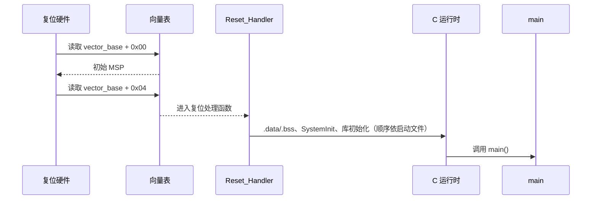

## 一句话结论

Cortex-M 复位时从当前生效的向量表装载初始 MSP 和 Reset_Handler 地址；随后启动文件按具体芯片、链接脚本和 C 运行时完成初始化，最后才进入 `main()`。

## 适用范围与前置知识

- 适用：Cortex-M3/M4 架构通用启动模型；具体 MCU 只在绑定其官方手册时讨论。
- 不适用：把向量表地址、BOOT0 采样时机、时钟树或分区偏移外推到未声明的芯片。
- 前置：C 指针/存储期、ELF 和链接脚本的基本概念。

## 启动流程图（Mermaid 失败时的文字降级）



文字步骤：复位 → 当前向量表映射 → 初始 MSP/Reset_Handler → 启动文件和 C 运行时 → `SystemInit` 等工程初始化 → `main()`。`.data/.bss` 与 `SystemInit` 的精确先后必须以实际启动文件为准。

## 核心代码（static-reviewed，未在具体 MCU 运行）

```c
/* 仅示意向量表形状；地址和段属性由具体启动文件/链接脚本决定。 */
typedef void (*isr_handler_t)(void);
extern unsigned long __stack_top;
void Reset_Handler(void);

__attribute__((section(".isr_vector")))
const unsigned long vector_table[] = {
    (unsigned long)&__stack_top,
    (unsigned long)Reset_Handler,
};
```

验证状态：`static-reviewed`；没有指定完整料号、链接脚本和下载工具，因此不标记为 `target-compiled` 或 `hardware-tested`。

## 调试步骤、反例与限制

1. 保存匹配固件的 ELF、Map 文件、启动文件、链接脚本和编译选项。
2. 在 `Reset_Handler` 设置断点，检查 MSP、PC、向量表基址和异常返回现场。
3. 分别记录 `.data` 拷贝、`.bss` 清零、时钟/FPU/VTOR 初始化的实际顺序。
4. 反例：看到某个工程把向量表放在 Flash 开头，就断言所有 Cortex-M 的 `vector_base` 都固定为该地址；这混淆了架构模型和芯片重映射。

## 30 秒回答与展开回答

30 秒回答：硬件读取向量表前两项得到 MSP 和 Reset_Handler；后续初始化由启动文件、链接脚本、工具链和芯片配置共同决定，不能只凭 `main()` 反推顺序。

展开回答：区分架构通用异常栈帧、芯片启动模式采样、工程向量表重定位和 C 运行时；用 ELF/Map/寄存器和启动日志建立证据链。

递进追问：

1. 异常进入时硬件自动压入哪些基本寄存器？Cortex-M4F 的扩展帧有什么边界？
2. 为什么 PendSV 常用于 RTOS 上下文切换，它与 SysTick 的职责如何分开？

## 自测与主动回忆入口

- 自测：按“复位—取 MSP—取 PC—运行时初始化—main”写出每一步输入、输出和一个可观测证据。
- 主动回忆：不看页面解释 `vector_base + 0x00` 与 `+0x04` 的含义，并明确哪些结论必须回到具体 MCU 手册。

## 来源与证据边界

Arm Cortex-M 指南支撑架构级向量表、异常和栈模型；CMSIS/芯片启动文件决定工程实现。没有完整料号、启动文件和链接脚本时，地址、重映射和采样时机均保持未知。
