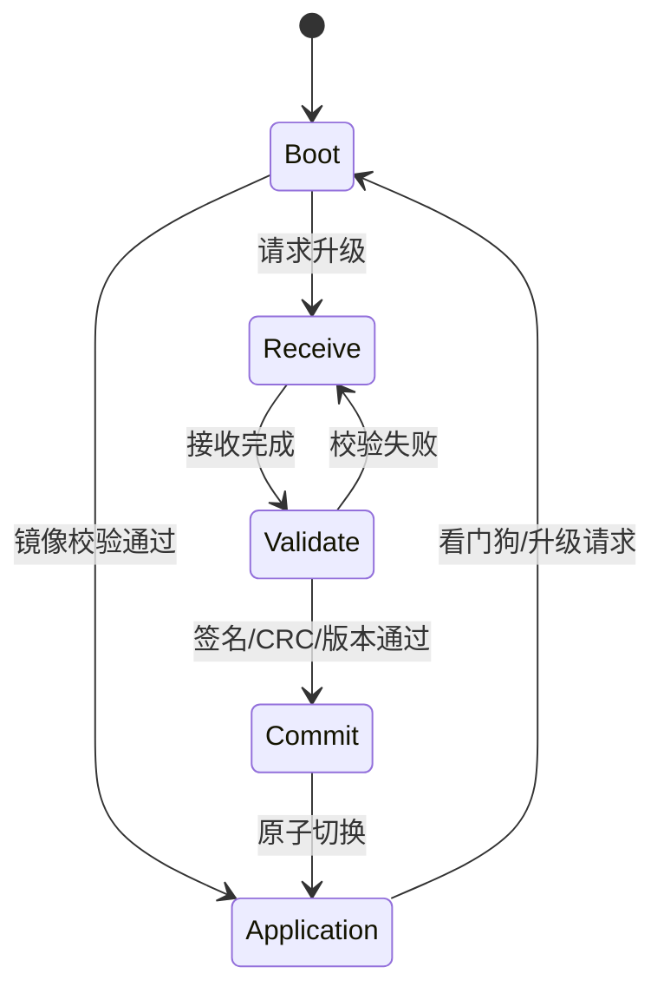

## 一句话结论

Bootloader 先定义镜像、校验、回滚和断电边界；低功耗先定义状态机、唤醒源和测量点，不能用“进入睡眠 API 返回”代替证据。

## 适用范围与前置知识

本课讨论通用 MCU Bootloader 设计和 STM32F103C8T6/Cortex-M3 的验证思路。具体启动地址、向量表偏移、Flash 页大小和低功耗电流必须绑定芯片手册、链接脚本和测量日志。

## 升级状态图



文字降级：Boot 读取元数据并选择镜像；接收阶段可断点续传；校验通过后才提交选择；异常重启回到可恢复状态。

## 最小元数据与伪代码

```c
struct image_slot {
    uint32_t magic;
    uint32_t version;
    uint32_t length;
    uint32_t crc32;
    uint32_t state; /* EMPTY, RECEIVING, VALID, BOOTED */
};

bool can_boot(const struct image_slot *slot, uint32_t actual_crc)
{
    return slot != NULL && slot->state == VALID &&
           slot->length != 0 && slot->crc32 == actual_crc;
}
```

这段代码只表达状态边界，未在 STM32F103C8T6 上运行。真实实现还要处理 Flash 擦写粒度、掉电中断、双备份元数据和向量表重定位。

## 低功耗调试步骤

1. 记录进入低功耗前的时钟树、SysTick、DMA、外设和唤醒源配置。
2. 用电流计或示波器记录“请求睡眠 → 实际电流变化 → 唤醒原因”，保存时间基准。
3. 唤醒后先记录复位原因、唤醒标志和时钟恢复状态，再恢复业务外设。

反例：只看到程序执行了 `WFI` 就宣称芯片进入目标功耗；只验证正常升级，不验证半包、掉电和版本回退。

## 30 秒回答与展开回答

30 秒回答：Bootloader 的核心是可验证、可恢复的镜像状态机，至少包含完整性、版本和断电恢复；低功耗的核心是明确状态、唤醒源和测量证据。地址、Flash 布局和唤醒寄存器必须以具体芯片资料为准。

展开回答：先画出 Boot/Receive/Validate/Commit/Application 状态，再定义每次写入的原子边界；低功耗则从时钟、外设、唤醒源和复位原因逐层排查。若没有目标型号、链接脚本和日志，只能给流程，不能给偏移和电流数值。

## 递进追问

1. 镜像已写完但设备断电，下一次启动如何避免跳入半写入镜像？
2. 唤醒后 UART 无输出，你会先检查时钟恢复、引脚复用还是业务线程？为什么？

## 自测与主动回忆

- 自测：列出升级状态机中必须持久化的三个字段，并说明每个字段如何帮助处理掉电。
- 主动回忆：不看页面画出“Boot → 接收 → 校验 → 提交 → 应用”的状态图，再写出三项不能凭经验填写的芯片参数。

## 来源和证据边界

Cortex-M 异常返回和 STM32F1 Flash/低功耗寄存器分别由 Arm 指南和 RM0008 约束；本课没有执行真实刷写或电流测量，不把伪代码和流程图表述为板级验证。
