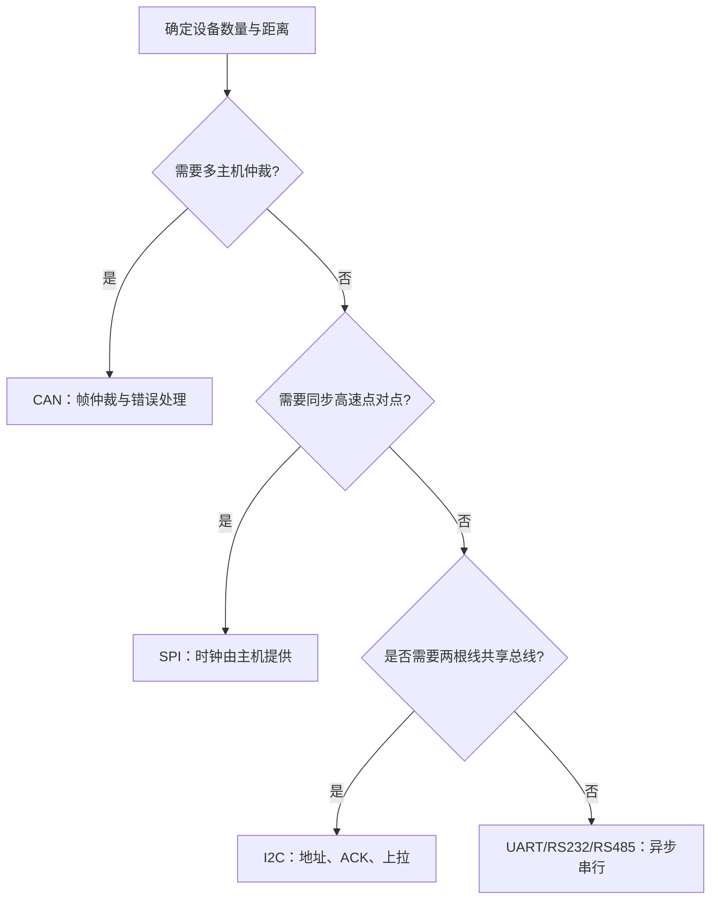

## 一句话结论

协议选型先看物理层、拓扑、实时性、带宽和故障模型，再看 MCU 外设寄存器；“能发出一帧”不等于链路可靠。

## 适用范围与前置知识

本课先建立协议对比框架，再用 STM32F1 参考手册作为外设实现入口。除特别注明外，不假设某一块开发板的引脚、电平转换芯片或终端电阻已经存在。前置知识是 C 指针、位运算、缓冲区和中断基本概念。

## 选型流程图



文字降级：先判拓扑和距离，再判是否需要主机时钟、地址和仲裁，最后核对电平与收发器。

## 关键差异

| 协议 | 典型连线/拓扑 | 关键机制 | 常见故障证据 |
| --- | --- | --- | --- |
| UART | 点对点，TX/RX/GND | 起始位、数据位、校验、停止位 | 波特率不一致、帧错误、溢出 |
| RS232 | 点对点，专用收发器 | 单端、较长距离的电平规范 | 电平未转换、地参考不正确 |
| RS485 | 半双工总线，差分收发器 | DE/RE、终端与偏置、总线方向 | 方向切换冲突、终端缺失、反射 |
| I2C | 多设备共享 SDA/SCL | 地址、ACK/NACK、开漏上拉、仲裁 | 上拉不合适、总线被拉低、地址冲突 |
| SPI | 主从点对点/多片选 | SCK、MOSI、MISO、CS，模式 0~3 | CPOL/CPHA 错、片选时序错 |
| CAN | 多主机差分总线 | 标识符仲裁、位填充、错误帧 | ACK 错、终端错误、总线关闭 |
| LIN | 单主机低成本总线 | Break、同步字、标识符和响应 | 同步误差、从节点无响应 |

## 核心代码与调试日志模板

```c
enum link_result { LINK_OK = 0, LINK_TIMEOUT = -1, LINK_FRAME_ERROR = -2 };

/* 伪代码：具体寄存器和中断标志必须绑定目标 MCU 手册。 */
enum link_result receive_frame(uint8_t *buf, size_t capacity,
                               size_t *length, uint32_t timeout_ms)
{
    if (buf == NULL || length == NULL || capacity == 0) return LINK_FRAME_ERROR;
    /* 1. 等待帧头；2. 校验长度；3. 读取 payload；4. 校验 CRC。 */
    (void)timeout_ms;
    *length = 0;
    return LINK_TIMEOUT;
}
```

建议记录：`bus=RS485 baud=115200 dir=TX len=8 status=timeout`、`i2c=1 addr=0x50 phase=address ack=0`、`spi=1 mode=3 cs=low rx=...`。这是调试记录格式，不是本项目真实抓到的板级日志。

## 调试方法与反例

1. 先确认逻辑分析仪/示波器看到的电平、时钟和帧边界，再看驱动返回值。
2. 对 RS485 单独记录 DE/RE 方向切换时刻；对 I2C 记录地址阶段 ACK；对 SPI 记录 CS 与 CPOL/CPHA。
3. 缩小为一帧、一个从设备和固定 payload，保留原始抓包与构建版本。

反例：看到 UART 能打印字符串就断言 RS485 总线可靠；看到 I2C 有 SCL 就断言目标地址正确；看到 SPI 有时钟就断言采样边沿匹配。

## 30 秒回答与展开回答

30 秒回答：UART 是异步点对点，I2C 用地址和 ACK 共享两根线，SPI 用主机时钟和片选换取吞吐，CAN 通过标识符仲裁并具备错误处理，LIN 则是低成本单主机总线。选型要把物理层、拓扑和故障证据一起说清楚。

展开回答：先分离电气层、链路帧和 MCU 外设三层；再说明时序、仲裁或 ACK 机制；最后给出抓包、寄存器状态、超时和重试策略。没有具体收发器、引脚复用和时钟配置时，不给出板级电平或速率结论。

## 递进追问

1. RS485 半双工发送后收不到响应，你如何区分方向脚时序错误与从机协议错误？
2. I2C 总线被拉低时，为什么不能只在软件里无限重试？需要保存哪些现场？

## 自测与主动回忆

- 自测：给出“多主机、短帧、需要总线仲裁”的场景，说明为何优先考虑 CAN，并列出还需核对的两项硬件证据。
- 主动回忆：合上页面，用“拓扑 → 时序 → 故障证据”三列复述 UART、I2C、SPI、CAN、LIN 的差异，并标出一个不能从通用协议推断的板级参数。

## 来源和证据边界

STM32F1 外设实现以 RM0008 对应型号和修订版为准；POSIX 只用于说明用户态接口的可移植边界。本课没有运行真实总线抓包，不把示例日志写成开发板实测结果。
