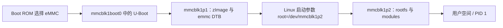

## 一句话结论

对本资料目录中的 ALPHA eMMC 方案，教程和配套脚本明确给出了 `mmcblk1boot0`、`mmcblk1p1`、`mmcblk1p2` 三类存储位置；U-Boot、内核/设备树和 rootfs 必须分别核对版本与目标分区，不能把另一介质的地址或脚本直接套用。

## 适用范围与前置知识

- 适用：正点原子《I.MX6U 用户快速体验 V2.8》2.2.1.2 的 eMMC 固件路径，以及同一资料目录中的 `imx6mkemmcboot.sh` v1.1、`Mfgtool2-eMMC-ddr512-eMMC.vbs`。
- 不适用：把教程中的 eMMC 步骤外推到 NAND、SD、其他 i.MX6 型号或不同板卡修订版；TFTP/NFS 只作为另一个网络启动教程的对照。
- 前置：分区、块设备、U-Boot、zImage、设备树和 rootfs 的基本概念。

## eMMC 启动链（流程图与文字降级）



文字步骤：Boot ROM 进入 eMMC 启动区域 → U-Boot 从 `boot0` 取得启动代码 → U-Boot 从第一个分区读取 `zImage` 和匹配的 `imx6ull-14x14-emmc-*.dtb` → 内核按 `root=/dev/mmcblk1p2` 挂载 rootfs → 用户空间启动。实际文件名和环境变量仍以目标镜像为准。

## 资料中观察到的分区与写入步骤

资料中的 eMMC 脚本把第一个分区设为约 32 MiB 的 FAT32 boot 分区，第二个分区使用 ext3 作为 rootfs；脚本随后执行以下写入动作（这里是资料内容摘录，不代表本机已运行）：

```text
echo 0 > /sys/block/mmcblk1boot0/force_ro
dd if=u-boot-imx6ull-14x14-ddr512-emmc.imx of=/dev/mmcblk1boot0 bs=1024 seek=1 conv=fsync
dd if=u-boot-imx6ull-14x14-ddr512-emmc.imx of=/dev/mmcblk1boot0 bs=1024 seek=500 conv=fsync
echo 1 > /sys/block/mmcblk1boot0/force_ro
mount /dev/mmcblk1p1 /mnt/boot
cp zImage /mnt/boot/
cp imx6ull-14x14-emmc-4.3-480x272-c.dtb /mnt/boot/
mount /dev/mmcblk1p2 /mnt/rootfs
tar jxfm rootfs.tar.bz2 -C /mnt/rootfs
mmc bootpart enable 1 1 /dev/mmcblk1
sync
```

教程还说明，MFG-Tool 的 `Mfgtool2-eMMC-ddr512-eMMC.vbs` 选择的是 eMMC、DDR512 配置；若核心板 DDR 容量不同，必须选择对应脚本或镜像。脚本中实际的设备节点、文件名和挂载点需要在目标系统再次确认。

## 调试步骤、日志和反例

1. 保存板卡丝印、核心板 DDR 容量、教程版本、U-Boot/内核/DTB 文件名和完整串口日志。
2. 在 Linux 下先用 `lsblk`、`blkid` 和 `cat /proc/partitions` 确认设备节点；不能因为另一台主机使用 `/dev/mmcblk1` 就跳过确认。
3. 在 U-Boot 阶段记录 `mmc list`、`mmc dev`、读取文件的实际路径和 `bootargs`；在 Linux 阶段核对 `Kernel command line`、`root=` 和根分区是否一致。
4. 每次只替换一个对象（U-Boot、zImage、DTB 或 rootfs），写入后执行 `sync`，再用校验值或文件大小确认复制结果。

当前工作区没有提供 `start.txt`，因此本课没有可引用的真实启动日志证据。上面的设备节点、文件名和 `root=` 只来自资料目录中的脚本/镜像文件名，不能写成“本次日志观察到”；也没有证据证明 TFTP/NFS 被使用。

反例：看到教程给出 `seek=1`、`seek=500` 或某个 DTB 文件名，就把它当成所有 eMMC、所有 DDR 配置和所有 ALPHA 版本的固定值；这会把资料绑定的实现细节误写成 SoC 通用规律。

## 30 秒回答与展开回答

30 秒回答：eMMC 启动要分开核对 boot0 中的 U-Boot、p1 中的内核/设备树和 p2 中的 rootfs；先确认设备节点、DDR/板卡版本和 `bootargs`，再逐项替换并记录日志。

展开回答：先区分 Boot ROM、U-Boot、Linux 早期启动和用户空间阶段，再用教程脚本、镜像文件名、分区表和串口日志建立证据链。当前没有 `start.txt`，因此不能宣称观察到某次启动顺序，也不能代替对脚本的实际运行验证。

递进追问：

1. 为什么 U-Boot 需要写入 eMMC boot0，而 zImage/DTB 放在 p1？不同介质的启动约束如何影响布局？
2. 如果 U-Boot 能读到 zImage 但 Linux 无法挂载 rootfs，应该优先检查哪几类证据？

## 自测与主动回忆入口

- 自测：给定一段 U-Boot 和 Linux 日志，分别标出 boot0、p1、p2 的证据，并写出一个仍需资料确认的假设。
- 主动回忆：合上页面，用 30 秒说出“boot0 → p1 → `root=/dev/mmcblk1p2`”的链路，并按“设备节点、镜像版本、分区、日志”四个评分点自评。

## 来源与证据边界

本课使用本地资料目录中的《I.MX6U 用户快速体验 V2.8》2.2.1.2、`imx6mkemmcboot.sh` v1.1 和 eMMC MFG-Tool 配置作为板级操作证据；公开来源登记只链接官方资料入口。教程说明覆盖的是其声明的 ALPHA/eMMC/DDR 配置，具体板卡仍需以丝印、DDR 容量和实际镜像匹配。TFTP/NFS 内容不作为本课的真实日志证据。
