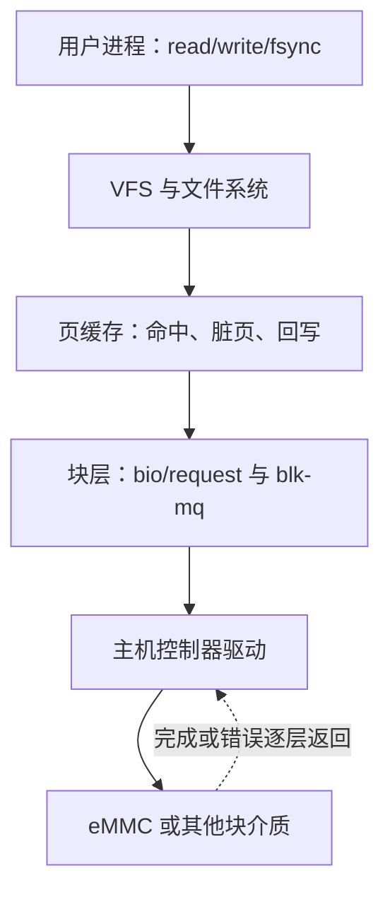

## 一句话结论

块设备按可寻址数据块承载文件系统和页缓存，I/O 要经过 VFS/文件系统、块层、请求队列、主机控制器与介质；“能看到设备节点”只验证了链路中的一小段。

## 适用范围与前置知识

- 适用：主线 Linux 块层概念、blk-mq 请求生命周期、文件系统到块设备的分层调试。
- 板级范围：ALPHA i.MX6ULL 课程只按用户确认的 eMMC 启动主线组织；控制器节点、引脚、电压和时钟仍以实际 DTS、内核和日志为准。
- 前置：字符设备、platform driver、设备树匹配、页缓存和基本进程 I/O。

## 块设备与字符设备

| 维度 | 字符设备 | 块设备 |
| --- | --- | --- |
| 访问模型 | 通常由驱动定义字节流/消息语义 | 可寻址扇区/块，请求可合并和调度 |
| 常见上层 | 专用 `/dev` 接口、tty、传感器 | 分区、文件系统、交换区、数据库文件 |
| 缓存关系 | 由具体接口和驱动决定 | 常经过页缓存与文件系统，也可有 direct I/O |
| 核心调试点 | file operations、等待队列、中断 | bio/request、队列限制、完成状态、介质错误 |

块设备节点也能被用户态读写，但这不意味着应绕过文件系统随意改写；对已挂载文件系统的底层设备直接写入可能破坏一致性。

## 从 read 到介质



文字降级：系统调用先进入 VFS/文件系统；缓存命中时可能暂不触达介质；需要真实 I/O 时形成块请求并派发给主机控制器驱动，完成状态再逐层返回。任何一层都可能让“写成功”和“数据已持久化”出现不同含义。

## 请求生命周期骨架

```c
static blk_status_t demo_queue_rq(struct blk_mq_hw_ctx *hctx,
                                  const struct blk_mq_queue_data *bd)
{
    struct request *rq = bd->rq;

    blk_mq_start_request(rq);
    /* 示例省略 request 遍历、DMA 映射、控制器提交和并发保护。 */
    blk_mq_end_request(rq, BLK_STS_IOERR);
    return BLK_STS_OK;
}
```

这是用于认调用边界的伪骨架，不是可加载驱动，也未在目标内核编译。真实实现必须绑定内核版本，正确设置容量和队列限制，处理分段、并发、DMA 映射、超时、热拔插及完成路径；存储驱动还可能位于 MMC、SCSI、NVMe 等具体子系统中，而不是自写通用块设备。

## eMMC 启动与运行时 I/O 的区别

Boot ROM/U-Boot 能从 eMMC 读出启动镜像，不等于 Linux 下分区、文件系统和持续写入都正常；反过来，Linux 能枚举块设备也不能证明当前 U-Boot 环境或启动分区正确。应分别保存：

- 启动阶段的加载命令、介质选择和实际日志。
- 内核枚举、分区识别和文件系统挂载日志。
- 运行时 I/O 的返回值、块层/控制器错误和持久化验证。

## 调试步骤

1. 从用户态记录文件、挂载点、设备号、返回值和 `errno`，确认操作落到哪个块设备。
2. 用 `findmnt`、`lsblk`、`/proc/partitions` 和 sysfs 建立“文件系统 → 分区 → 整盘 → 控制器”的映射。
3. 区分页缓存现象与介质 I/O；需要持久化语义时明确 `fsync`、挂载选项和掉电模型。
4. 检查 `dmesg` 中块层、文件系统、MMC/控制器的超时与错误，但不把单条日志当根因。
5. 真板写测试必须使用可牺牲分区和可恢复备份；本课不自动执行破坏性介质测试。

## 反例

- `write()` 返回正数就宣称数据已经抗掉电持久化。
- `/dev/mmcblkX` 出现就宣称文件系统、分区和 eMMC 全部健康。
- 在已挂载根文件系统对应块设备上直接跑覆盖写测试。
- 把网上另一块 i.MX6ULL 板的 USDHC 节点、分区号或启动偏移复制为本板结论。

## 30 秒回答

块设备提供可寻址块并承载分区和文件系统。应用 I/O 可能先命中页缓存，真实请求再经块层和 blk-mq 派发到控制器，完成或错误逐层返回。排查要建立文件、挂载点、分区、整盘和控制器映射，并区分“写入缓存”“提交设备”和“抗掉电持久化”。

## 展开回答

我会先确认用户态返回值和目标路径，再用挂载与 sysfs 信息找到底层设备；随后判断是否走页缓存、请求是否进入块层、控制器是否完成，最后验证文件系统一致性和介质持久化。对于 eMMC 启动，还要把 Boot ROM/U-Boot 的启动读取与 Linux 运行时块 I/O 分成两条证据链。

## 递进追问

1. 为什么 `write()` 成功、`fsync()` 成功和掉电后数据仍存在是三个不同层级的结论？
2. 系统从 eMMC 正常启动但高负载写入超时，你会怎样区分文件系统、块层队列、控制器和介质问题？

## 自测与主动回忆入口

- 自测：画出一个文件到 eMMC 的完整路径，并为 VFS、页缓存、块层、控制器和介质各列一种证据。
- 主动回忆：合上页面解释块设备与字符设备的三点差异，再说出“节点存在”不能证明的三个结论。

## 来源和证据边界

块层与驱动模型来自 Linux 官方文档。示例没有绑定目标内核 API、ALPHA 板 DTS 或真实运行日志；不提供破坏性写盘命令，也不推断设备名、分区、启动偏移和控制器参数。
