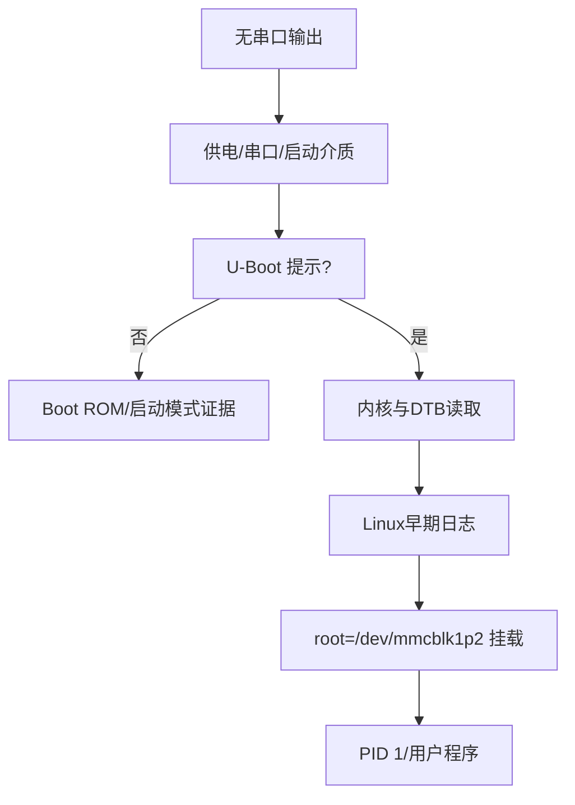

## 启动链不是一条黑盒命令

把故障按“是否到达下一个阶段”分段：Boot ROM/SPL（若使用）→ U-Boot proper → 内核和 DTB 加载 → Linux 早期启动 → 根文件系统 → PID 1 和用户程序。每段都要记录执行者、输入、输出、日志位置和下一步入口。

## 诊断矩阵

| 现象 | 先确认 | 不要直接推断 |
| --- | --- | --- |
| 串口没有任何输出 | 供电、串口连接、启动介质和 Boot Mode | 不能直接认定是内核崩溃 |
| U-Boot 有提示但 `bootz` 失败 | 内核地址、解压格式、DTB 地址和 `bootargs` | 不能套用另一块板的地址 |
| 内核开始打印后停住 | 内核配置、DTB 匹配、时钟/电源/驱动 probe | 不能把板级 DTS 当作 SoC 通用事实 |
| 内核完成但没有用户空间 | `root=`、文件系统驱动、挂载错误和 init 路径 | 不能把 PID 1 问题归咎于 U-Boot |

## 企业排障习惯

先保存完整串口日志和介质校验值，再一次只改变一个变量。对 U-Boot 环境、内核、DTB、根文件系统和网络启动分别记录版本；用 `printenv`、加载地址回显、内核启动参数和设备树反编译结果建立证据链。遇到 TFTP/NFS 时，把网络链路、服务器导出、权限、文件版本和目标端 `root=` 分开验证。

## ALPHA V2.4 边界

本课只核验 NXP/U-Boot/Linux 的通用启动分层和诊断方法。正点原子 ALPHA V2.4 的拨码、SD/eMMC/NAND 偏移、分区、U-Boot 默认环境、DTS、脚本和镜像组合，必须与对应官方资料逐项匹配；当前不填猜测值，仍标记为“待板级核验”。

## 一句话结论

Linux BSP 启动故障要按阶段和输入输出隔离；对本资料中的 ALPHA eMMC 路径，只有教程或真实日志明确出现的设备、文件和参数才能写成事实，其余保持待核验。

## 适用范围与前置知识

- 适用：i.MX6ULL/U-Boot/Linux 启动链和 eMMC 调试方法。
- 不适用：把 TFTP/NFS 对照命令、相邻板卡教程或通用网络参数写成当前 `start.txt` 的事实。
- 前置：Boot ROM、U-Boot `bootz`、设备树、rootfs、串口日志。

## 分层诊断流程图（Mermaid 失败时的文字降级）



文字步骤：先确定是否进入 U-Boot，再确认 p1 中的内核/DTB，随后核对内核命令行和 p2 rootfs，最后排查用户空间。

## 核心代码、日志与调试步骤

```text
U-Boot：mmc dev/list、文件名、读取字节数、bootz 返回值
Linux：Linux version、Machine model、Kernel command line、rootfs 挂载结果
用户空间：PID 1、服务启动、最后一条串口日志
```

1. 保存完整串口日志、镜像校验值、U-Boot/内核/DTB/rootfs 版本和板卡丝印。
2. 每次只替换一个输入，重新记录加载地址、文件大小和返回码。
3. eMMC 场景优先核对 `mmcblk1boot0`、`mmcblk1p1`、`mmcblk1p2` 和 `root=` 是否一致。
4. 反例：在当前没有 `start.txt` 的情况下虚构 NFS 注册日志，或把另一块板的偏移套入当前镜像；TFTP/NFS 只能作为通用教程对照。

## 30 秒回答与展开回答

30 秒回答：按 Boot ROM/U-Boot、内核/DTB、rootfs、PID 1 分层；每层记录输入输出和版本，eMMC 只使用已匹配的 boot0、p1、p2 证据。

展开回答：把架构、SoC、板级资料和一次启动日志分开，先证明到达了哪一阶段，再逐项验证文件、参数和分区。网络启动命令仅作通用对照。

递进追问：

1. U-Boot 能读到 zImage 但内核无法挂载 p2 时，如何区分 DTB、`root=` 和文件系统问题？
2. 为什么不能仅凭 `Machine model` 一行确定完整 ALPHA 板卡版本？

## 自测与主动回忆入口

- 自测：给出一段 eMMC 启动日志，标出四个阶段各自的证据和一个不能下结论的地方。
- 主动回忆：合上页面复述“阶段—输入—输出—证据边界”四列并自评。

## 来源与证据边界

NXP、U-Boot、Linux 官方文档以及本地正点原子用户手册支撑通用和 eMMC 资料级结论。当前工作区没有 `start.txt`，因此没有一次真实启动日志可引用；脚本和教程不等于脚本已经在本机运行成功，TFTP/NFS 仅作通用对照。
