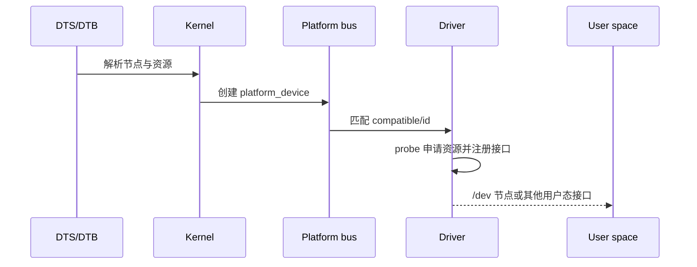

## 一句话结论

设备树描述硬件，驱动描述行为，platform 总线负责匹配；`probe` 被调用只能说明匹配和初始化路径走到了某个阶段，不代表硬件业务已经验证成功。

## 适用范围与前置知识

本课使用主线 Linux 驱动模型和设备树语义，BSP 细节需绑定目标内核、SoC、板卡 DTS 和构建产物。前置知识是 C 结构体、文件描述符、进程/线程和交叉编译基本概念。

## 从 DTS 到设备节点



文字降级：DTB 被内核解析后形成设备对象；总线匹配驱动；`probe` 获取资源并注册字符设备、sysfs 或其他接口；用户态再通过明确的设备节点访问。

## 最小结构示例

```c
static const struct of_device_id demo_of_match[] = {
    { .compatible = "vendor,device-v1" },
    { }
};

static int demo_probe(struct platform_device *pdev)
{
    struct resource *mem = platform_get_resource(pdev, IORESOURCE_MEM, 0);
    if (mem == NULL) return -ENODEV;
    /* 真实驱动还需 devm_ioremap_resource、时钟/电源和错误回滚。 */
    return 0;
}
```

示例中的 `vendor,device-v1` 是占位的匹配字符串，不能复制到具体板卡。真实值必须同时出现在目标 DTS 和驱动的 `of_device_id` 表中。

## 调试方法与反例

1. 保存构建时使用的 DTS/DTB、内核 commit、模块 vermagic 和启动参数。
2. 依次检查 `dmesg`、`/sys/bus/platform/devices`、`/sys/bus/platform/drivers`、设备节点权限和 `udev` 规则。
3. `probe` 未调用时先查 compatible、状态、总线和模块加载；`probe` 返回错误时再查资源、时钟、复位和错误回滚。

反例：看到 `/dev/demo` 存在就断言寄存器读写正确；看到 DTS 节点存在就断言驱动已经匹配；把某块板的 `reg`、IRQ 和 GPIO 数字复制到另一块板。

## 30 秒回答与展开回答

30 秒回答：设备树告诉内核有哪些硬件和资源，platform 总线根据 `compatible` 等信息匹配驱动，`probe` 负责申请资源并注册用户态接口。排查时要把 DTB、内核、驱动和设备节点的证据链串起来，不能只看一个日志。

展开回答：先确认编译进内核的 DTB 与启动时加载的 DTB 一致，再确认设备状态和匹配表，之后检查 `probe` 每个资源申请点和错误回滚，最后用用户态读写与硬件寄存器/示波器证据验证功能。

## 递进追问

1. `compatible` 看起来一致但 `probe` 没有执行，你会按什么顺序排查？
2. `probe` 成功但 `read()` 阻塞，如何区分中断未到、等待队列条件错误和硬件没有响应？

## 自测与主动回忆

- 自测：写出“DTS → platform_device → 匹配 → probe → /dev”的五个节点，并为每个节点列一个 Linux 证据。
- 主动回忆：不看页面解释为什么 `probe` 成功不等于业务成功，并说出两个不能从通用教程猜测的板级参数。

## 来源和证据边界

设备树和驱动模型分别参考 Linux 官方文档；NXP BSP 只作为 i.MX 平台发行入口。未绑定具体 ALPHA 资料包版本、DTS 和日志时，不给出板级地址、GPIO、IRQ 或启动脚本结论。
