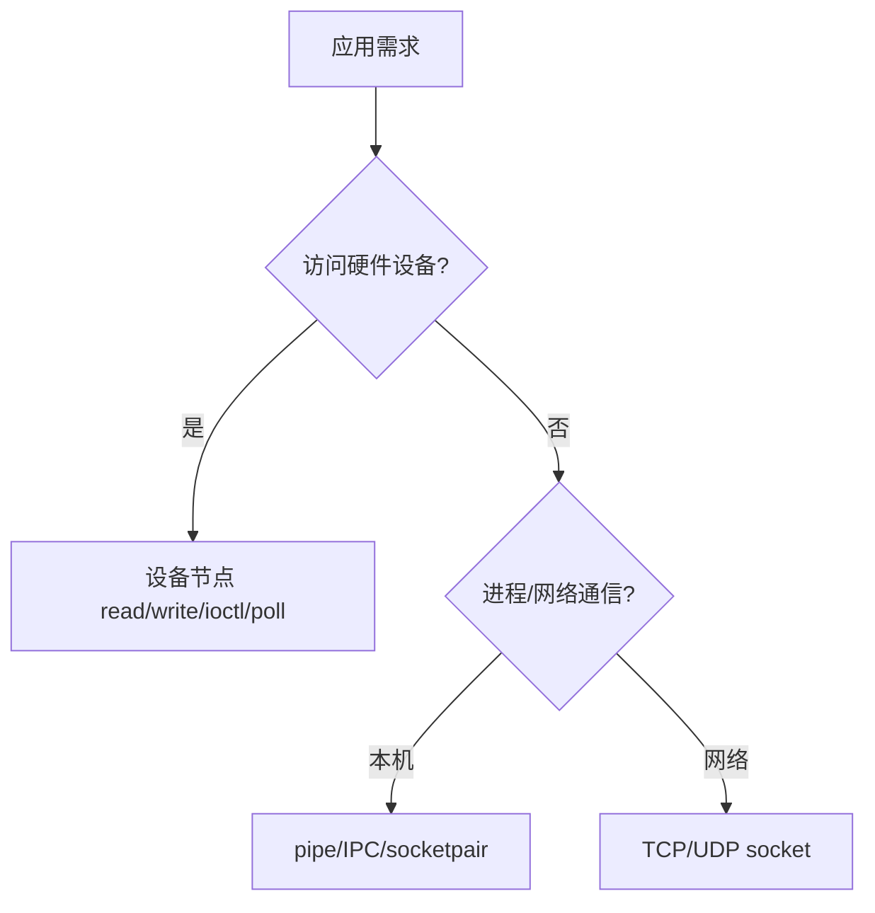

## 一句话结论

socket 是进程间和网络通信接口，字符设备是设备文件接口；两者都需要稳定的用户态 ABI、明确的阻塞/错误语义和边界检查，不能把一个接口的语义硬套到另一个。

## 适用范围与前置知识

适用于 Linux 用户态与驱动接口设计，具体内核实现以目标版本为准。前置知识是文件描述符、系统调用、TCP/UDP 和 `copy_to_user`。

## 接口选择图



文字降级：硬件控制走设备文件接口，进程或网络通信走 IPC/socket；应用层仍要定义消息边界、超时和错误恢复。

## 核心代码与边界

```c
struct sensor_request {
    uint32_t version;
    uint32_t length;
    uint64_t user_ptr;
};
```

ioctl 结构应带版本和长度字段，内核按长度检查并拒绝未知扩展；指针不能直接解引用。TCP 是字节流，必须在应用层设计长度前缀或固定帧。

## 调试方法

1. 先写 ABI 表：命令、输入输出、阻塞、超时、错误码和兼容策略。
2. 用 `strace`、`ss`、`tcpdump`（网络场景）和驱动 `dmesg` 对齐一条请求。
3. 测试短包、拆包、重复请求、进程退出和设备拔出等错误路径。
4. 检查 32/64 位、结构体对齐和字节序，禁止把内核指针或填充字节暴露给用户态。

反例：把 TCP 一次 `send` 当成一次 `recv`；用 ioctl 传裸指针且不校验；设备节点和 socket 共用一套未版本化结构体。

## 30 秒回答与展开回答

30 秒回答：字符设备解决应用访问硬件，socket 解决进程/网络通信，接口设计都要定义 ABI、边界、阻塞和错误语义。调试用 strace/ss/dmesg 或抓包把用户请求与内核行为对齐。

展开回答：我会先确认接口职责，再写版本化消息格式和超时策略。设备文件要处理用户内存和并发，TCP 要处理字节流分帧，不能只验证“偶尔能通”。

## 递进追问

1. 如何设计 `poll` 让设备数据到达时同时唤醒多个等待者？
2. 用户态结构体升级后，内核如何兼容旧版本而不读取越界？

## 自测与主动回忆

- 自测：为一个传感器服务分别设计设备文件和 TCP 接口，写出各自的消息边界和错误码。
- 主动回忆：说出“设备节点”和“socket fd”共同点与不同点。

## 来源和证据边界

系统调用和 socket 语义以 Linux man-pages/POSIX 为准，驱动接口以 Linux Driver API 和目标内核头文件为准；不对特定厂商 BSP 的私有 ioctl 做通用承诺。
