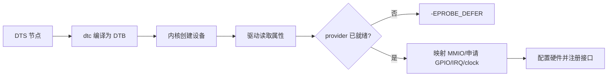

## 一句话结论

设备树描述硬件资源和连接关系，驱动通过标准属性和 provider API 获取它们；属性存在、格式正确、provider 已注册和电气配置正确是四个独立条件。

## 适用范围与前置知识

适用于 Linux 设备树使用模型和常见 platform 驱动。前置知识是 DTS 语法、设备节点和 probe；具体 `#address-cells`、GPIO 极性、时钟索引必须绑定 SoC DTSI 和板级 DTS。

## 资源解析流程图



文字降级：DTS 编译进 DTB 后，驱动按属性读取资源；provider 未就绪不等于属性错误，资源获取成功也不等于电气配置正确。

## 核心代码（API 示意）

```c
struct resource *mem = platform_get_resource(pdev, IORESOURCE_MEM, 0);
int irq = platform_get_irq(pdev, 0);
struct clk *clk = devm_clk_get(&pdev->dev, NULL);
struct gpio_desc *reset = devm_gpiod_get(&pdev->dev, "reset", GPIOD_OUT_LOW);
```

示例仅表示资源类别，不能据此推断某板的索引、极性或引脚。错误码要原样保留，尤其是 `-EPROBE_DEFER`。

## 调试方法

1. 先保存运行中的 DTS/DTB、内核 commit 和节点完整路径，再对照源码。
2. 使用 `dtc`/`fdtdump` 检查属性编码，使用 sysfs/debugfs（目标内核启用时）确认设备和时钟状态。
3. 对每个资源记录读取 API、索引、返回值和 provider 名称，区分缺属性、格式错、冲突和延迟探测。
4. 用示波器或逻辑分析仪验证 GPIO 电平、IRQ 边沿和时钟输出，不把 DTS 文本当成物理事实。

反例：复制别的 SoC 的 GPIO 编号；看到 `reg` 就直接把数值当 CPU 虚拟地址；把 `EPROBE_DEFER` 改成成功继续运行。

## 30 秒回答与展开回答

30 秒回答：设备树描述资源，驱动通过 `platform_get_resource`、GPIO/IRQ/clock API 获取。调试要同时看 DTB、provider 状态、返回码和实际波形，不能只看 DTS 是否能编译。

展开回答：我会固定 SoC、板级 DTS、内核版本和 bootloader 传入的 DTB，按缺属性、编码、provider、冲突和电气五层排查。任何引脚和索引结论都要绑定具体文件。

## 递进追问

1. 为什么同一份 DTS 在不同 bootloader/内核组合下可能表现不同？
2. GPIO 极性写反时，驱动日志、示波器和中断计数分别会呈现什么证据？

## 自测与主动回忆

- 自测：列出 `reg`、GPIO、IRQ、clock 四类资源各自的“文本证据”和“运行证据”。
- 主动回忆：复述属性、provider、API、物理波形四层证据如何闭环。

## 来源和证据边界

设备树模型以 Linux Devicetree Usage Model 和目标内核 API 为准；具体 ALPHA 板卡资源要以对应资料包、运行 DTB 和日志核实，不从通用示例外推。
