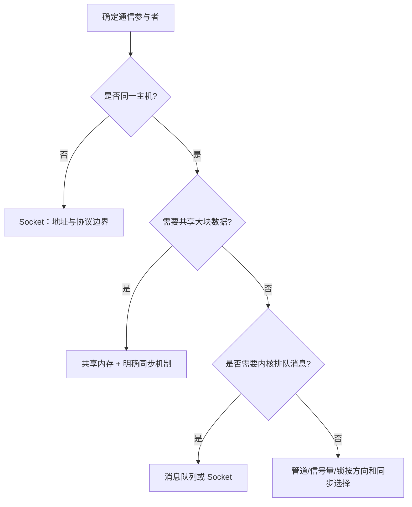

## 一句话结论

IPC 选型先问数据方向、生命周期、同步责任和故障恢复，再选择管道、共享内存、消息队列、信号量/锁或 Socket；`ps/top` 负责观察，不替代程序内证据。

## 适用范围与前置知识

本课讨论 Linux/POSIX 用户态常见机制。具体系统调用、权限、命名空间和 libc 行为要以目标 Linux 与 man-pages 版本为准。前置知识是进程、文件描述符和基本 C 错误处理。

## IPC 选择流程图



文字降级：跨主机优先考虑 Socket；同机大数据用共享内存但必须另配同步；单向父子数据流可用管道；同步和互斥不要与数据传输混为一谈。

## 对比表

| 机制 | 适合场景 | 关键边界 | 典型排查 |
| --- | --- | --- | --- |
| 匿名管道 | 有亲缘关系的单向流 | 生命周期跟随文件描述符 | 未关闭无关端导致读端不 EOF |
| 有名管道 | 无亲缘关系的本机流 | 文件系统名字和权限 | 打开阻塞、权限或残留节点 |
| 共享内存 | 大块数据、低拷贝 | 必须另配同步和协议 | 可见性、竞态、版本不一致 |
| 消息队列 | 有边界的消息 | 队列容量和消息格式 | 满队列、优先级和超时 |
| 信号量/互斥锁 | 资源计数或所有权 | 持有者、顺序、超时 | 死锁、优先级和异常退出 |
| Socket | 跨进程/跨主机 | 字节流或报文边界 | 连接、超时、半关闭和重连 |

## 核心代码与观察命令

```c
ssize_t read_full(int fd, void *buf, size_t length)
{
    size_t done = 0;
    while (done < length) {
        ssize_t n = read(fd, (char *)buf + done, length - done);
        if (n <= 0) return n;
        done += (size_t)n;
    }
    return (ssize_t)done;
}
```

可复现观察顺序：`ps -o pid,ppid,stat,wchan:24,cmd` → `top -H -p <pid>` → `strace -f -tt -p <pid>`。这些命令显示进程/线程和系统调用边界，不能单独证明应用层协议正确。

## 调试方法与反例

1. 先画参与者、数据方向和同步关系，再记录 PID、线程、FD、阻塞系统调用和超时。
2. 共享内存问题优先查协议版本、内存布局和同步，而不是直接加 sleep。
3. 锁问题记录获取顺序、持有时间和异常退出路径；用最小复现验证修复。

反例：把 `read()` 返回非零当作一条完整消息；看到 CPU 使用率低就断言线程没有阻塞；认为有名管道天然支持多生产者的消息边界。

## 30 秒回答与展开回答

30 秒回答：管道和 Socket 适合流，消息队列保留消息边界，共享内存减少拷贝但必须配同步，信号量和互斥锁解决的是同步/所有权。排查时用 `ps`、`top` 和 `strace` 观察状态，再回到程序的协议和锁顺序。

展开回答：先确定参与者和生命周期，再决定内核是否搬运数据、是否需要命名和权限、消息边界由谁维护，最后定义超时和恢复策略。任何“阻塞”结论都要带 PID/TID、系统调用和时间戳。

## 递进追问

1. 共享内存为什么不能只用一个 `volatile` 标志解决跨线程同步？
2. `top` 显示线程 CPU 很低但请求超时，你会如何结合 `wchan` 和 `strace` 定位？

## 自测与主动回忆

- 自测：为“父子进程传递一段文本”和“两个进程共享视频帧”分别选 IPC，并写出一个必须处理的边界。
- 主动回忆：合上页面复述“传输机制”和“同步机制”的区别，再说出 `ps`、`top`、`strace` 各自回答什么问题。

## 来源和证据边界

系统调用语义以 Linux man-pages 和目标 POSIX 版本为准；命令输出会受发行版、内核和权限影响。本课示例未在目标板上运行，不把命令模板当作真实故障日志。
