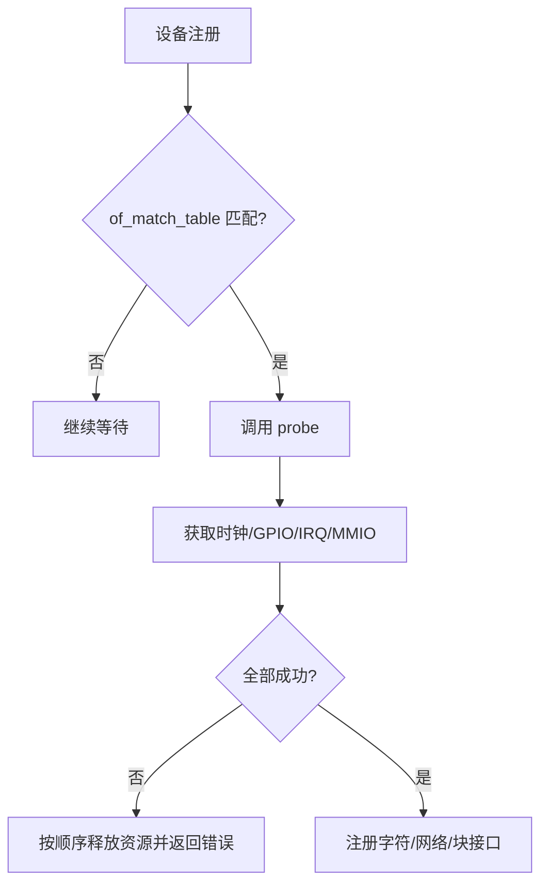

## 一句话结论

platform 驱动的核心不是函数名，而是匹配表、probe 资源获取和失败回滚；probe 返回成功前必须证明所需资源已准备好，remove 必须能安全撤销。

## 适用范围与前置知识

适用于主线 Linux platform 总线和设备树设备，具体 API 随内核版本变化。前置知识是设备树节点、驱动注册和内核错误码。

## 匹配流程图



文字降级：总线匹配后进入 probe，资源全部成功才注册上层接口；任何一步失败都要撤销已经完成的步骤。

## 核心代码（结构示意）

```c
static int demo_probe(struct platform_device *pdev)
{
    struct resource *res = platform_get_resource(pdev, IORESOURCE_MEM, 0);
    void __iomem *base = devm_ioremap_resource(&pdev->dev, res);
    if (IS_ERR(base)) return PTR_ERR(base);
    return devm_request_irq(&pdev->dev, irq, demo_irq, 0, dev_name(&pdev->dev), data);
}
```

示例强调错误返回和设备管理资源的关系，真实 IRQ、寄存器和设备树属性必须按目标硬件资料核对。不能从节点名字猜资源编号。

## 调试方法

1. 用 `modalias`、`of_match_table`、`dmesg` 确认匹配失败还是 probe 内部失败。
2. 每次资源获取打印资源类型、错误码和设备节点路径，避免只显示“probe failed”。
3. 对时钟未开启、GPIO 不存在、IRQ 冲突、映射失败分别构造错误路径，检查是否留下节点或中断。
4. 卸载/重新加载模块并运行并发访问，验证 devm 与手动清理没有重复释放。

反例：probe 中资源失败却继续注册 `/dev`；把 `-EPROBE_DEFER` 当成永久错误；remove 中访问已释放的私有数据。

## 30 秒回答与展开回答

30 秒回答：platform 驱动先通过设备树/匹配表找到设备，再在 probe 中获取 MMIO、IRQ、GPIO、时钟等资源；资源未齐全就返回错误并回滚，成功后才注册上层接口。

展开回答：调试时先区分匹配失败、资源暂不可用和真正硬件错误，记录节点路径与 errno。`devm_*` 只能减少清理代码，不会替你修正资源顺序或业务线程生命周期。

## 递进追问

1. `-EPROBE_DEFER` 何时合理，如何避免无限延迟而没有证据？
2. 一个设备需要多个时钟和复位控制器时，probe 的回滚顺序如何设计？

## 自测与主动回忆

- 自测：画出匹配、probe、资源获取、接口注册、失败回滚五个节点，并为每个节点写 errno 证据。
- 主动回忆：用一句话解释“节点匹配成功”为什么不等于“驱动可用”。

## 来源和证据边界

platform 总线、设备管理资源和设备树匹配以 Linux Driver API、Devicetree Usage Model 和目标内核源码为准；板级资源编号必须以实际 DTS 和硬件资料为证。
