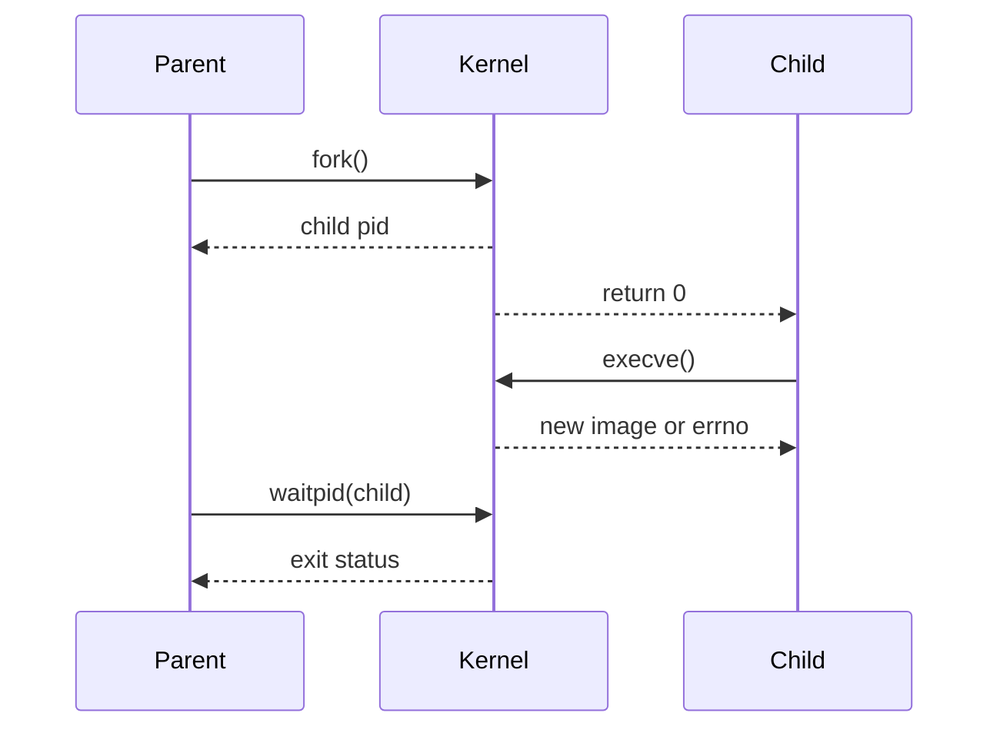

## 分层

分别标记 POSIX 接口、Linux 特有系统调用和 glibc 封装。交叉编译目标、内核版本和 libc 实现必须在具体实验中说明。

## 练习

从 `fork`、`exec`、`wait` 和文件描述符继承关系画出父子进程时序，并列出失败定位信息。

## 一句话结论

Linux 用户态进程调试要把 `fork`/`exec`/`wait` 的生命周期和文件描述符所有权分开记录；系统调用返回值、`errno` 和目标 libc/内核版本比“程序看起来运行了”更有证据价值。

## 适用范围与前置知识

- 适用：Linux/POSIX 用户态进程与文件 I/O，示例默认主机 Linux。
- 不适用：把 POSIX 接口或 glibc 行为外推为内核驱动、BSP 或其他 libc 的保证。
- 前置：C 指针、进程/线程概念、shell 和基础 GDB。

## 进程生命周期时序图（Mermaid 失败时的文字降级）



文字步骤：父进程调用 `fork` → 内核产生子进程 → 子进程 `exec` 替换映像 → 父进程 `waitpid` 回收并读取状态。文件描述符是否关闭、继承或重定向要逐项记录。

## 核心代码、日志与调试步骤

```c
#include <errno.h>
#include <stdio.h>
#include <sys/wait.h>
#include <unistd.h>

pid_t child = fork();
if (child == 0) {
    execl("/bin/echo", "echo", "child", (char *)NULL);
    perror("exec");
    _exit(127);
}
if (child > 0) {
    int status = 0;
    if (waitpid(child, &status, 0) < 0) perror("waitpid");
}
```

日志至少记录：`pid ppid syscall return errno fd state`。调试时先确认目标架构、内核和 libc，再用 `strace -f` 或 GDB 对照系统调用边界。反例：只看子进程输出就认为 `exec` 成功，或忽略父进程关闭写端导致管道永不 EOF。

## 30 秒回答与展开回答

30 秒回答：`fork` 产生新进程，`exec` 替换子进程映像，`waitpid` 回收并取得状态；每步都要检查返回值、`errno` 和文件描述符继承。

展开回答：区分 POSIX 语义、Linux 系统调用和 libc 封装，用 PID、系统调用时间线和 fd 表重建生命周期；主机成功不代表交叉目标 ABI 一致。

递进追问：

1. 为什么 `fork` 后父子进程的文件描述符指向同一 open file description？
2. `exec` 失败时如何保证子进程不会继续执行父进程的业务逻辑？

## 自测与主动回忆入口

- 自测：画出一个父子进程和管道的 fd 关闭时序，指出可能导致阻塞的端点。
- 主动回忆：合上页面复述“fork—exec—wait—fd—errno”五点并自评。

## 来源与证据边界

POSIX 与 Linux 用户态手册支撑接口语义；未绑定具体目标 libc、内核和运行日志时，不给出板级进程行为结论。
