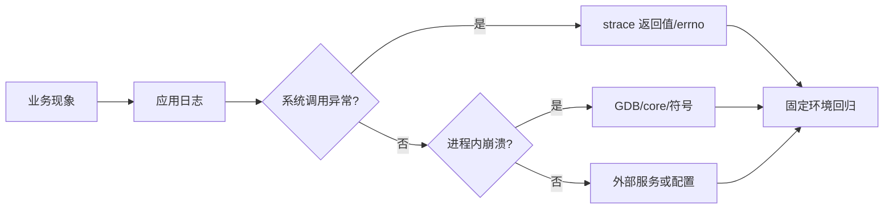

## 从现象到边界

先确认故障发生在进程、系统调用、内核驱动还是网络对端。应用日志回答业务状态，`strace` 观察系统调用边界，GDB 观察进程内的线程、栈和变量，内核日志工具则不能替代用户态证据。

## 推荐流程

1. 用带符号的构建复现，记录目标架构、libc、编译器、优化等级和构建提交；发布构建保留可匹配的未剥离符号文件。
2. 使用 GDB 在稳定断点、异常信号和关键状态转移处采样。多线程问题要记录线程 ID、锁顺序和等待条件，而不是只看主线程。
3. 用 `strace -f -tt -o trace.log ./app` 观察 `openat`、`read`、`poll`、`connect` 等边界；重点看返回值和 `errno`，不要把系统调用日志当成源代码执行顺序的完整替代。
4. 对崩溃启用 core dump，保留可执行文件、共享库版本、core、命令行和环境变量。core 缺少匹配符号时，堆栈只能作为线索。
5. 在目标板交叉调试时，确认 GDB、sysroot、动态加载器和目标 libc 相互匹配；主机上成功不代表 ARM 目标上 ABI 相同。

## 故障报告最小字段

```text
目标与固件：
输入与复现率：
进程/线程：
GDB backtrace：
关键系统调用及 errno：
core 与符号是否匹配：
已排除的假设：
修复与回归结果：
```

本课覆盖 POSIX/Linux 用户态调试方法，不把 `strace`、GDB 或浏览器 C runner 描述成真实 i.MX6ULL 内核或驱动调试器。

## 一句话结论

Linux 用户态故障应沿进程、系统调用、线程和外部依赖分层取证；GDB、`strace`、core 和应用日志各自覆盖不同边界，不能互相替代。

## 适用范围与前置知识

- 适用：Linux/POSIX 用户态程序，包含交叉调试的证据整理方法。
- 不适用：把用户态工具输出当作内核驱动、U-Boot 或真实 i.MX6ULL 板级验证。
- 前置：进程/线程、文件 I/O、ELF 符号和 shell。

## 故障定位流程图（Mermaid 失败时的文字降级）



文字步骤：先记录业务现象，再判断系统调用、进程内部或外部依赖边界，最后用匹配产物和回归测试闭环。

## 核心代码、日志与调试步骤

```text
目标与提交：arm32-linux / build-commit=...
进程/线程：pid=... tid=...
GDB：signal=... pc=... backtrace=...
系统调用：openat(...) = -1 errno=...
符号与 sysroot：匹配/不匹配
回归：复现次数 ... 修复后 ...
```

1. 使用带符号构建和匹配的 sysroot，记录编译器、libc、优化和目标架构。
2. 用 `strace -f -tt` 观察返回值/`errno`，再用 GDB 查看线程和栈。
3. 保留 core、可执行文件、共享库版本、命令行和环境变量。
4. 反例：core 缺少匹配符号时直接下结论，或把浏览器 runner 的输出当作 ARM 目标 ABI 证据。

## 30 秒回答与展开回答

30 秒回答：应用日志看业务，`strace` 看系统调用，GDB/core 看进程内部；先匹配架构、libc、符号和 sysroot，再做回归。

展开回答：按进程、线程、系统调用和外部依赖建立证据表，每次只改变一个变量；工具输出是定位线索，不能替代目标环境验证。

递进追问：

1. `strace` 显示 `EINTR` 时，如何判断是信号重试还是业务逻辑错误？
2. 交叉 GDB 的 sysroot 不匹配会造成哪些假象，如何最小化验证？

## 自测与主动回忆入口

- 自测：给定一段 GDB backtrace 和 `strace`，分别标出可证明事实、假设和下一步动作。
- 主动回忆：合上页面复述“业务—系统调用—进程—外部依赖—回归”五层并自评。

## 来源与证据边界

Linux man-pages、POSIX 和 GDB 文档支撑用户态工具语义；没有匹配目标文件和真实板级日志时，不声明 i.MX6ULL 内核或驱动行为。
