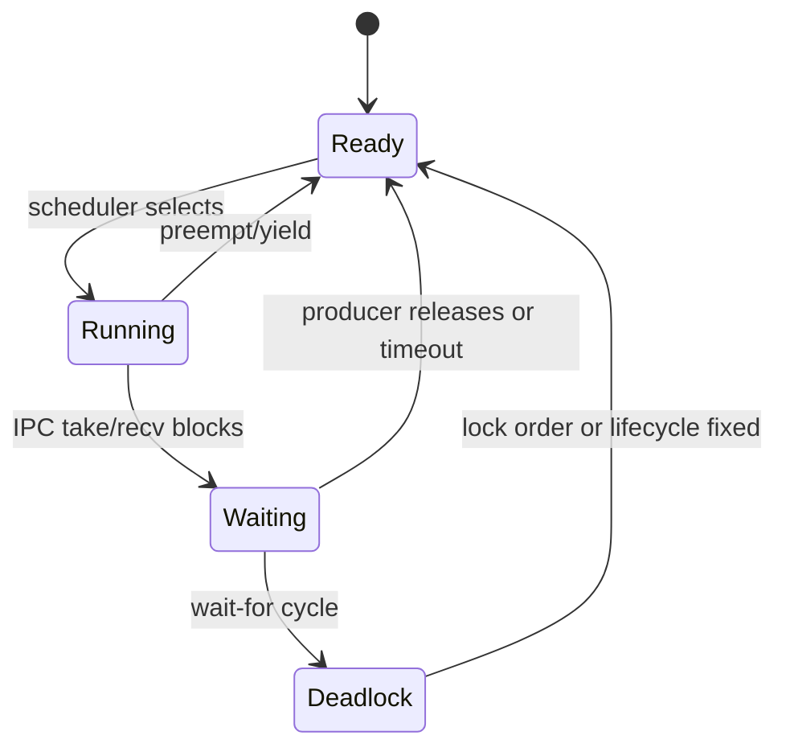

## 先区分机制层

RTOS 的阻塞、就绪和调度是通用机制；线程控制块、就绪队列、IPC 对象和 API 名称是 RT-Thread 实现；PendSV、栈帧和中断屏蔽是 Cortex-M port；具体 tick、时钟源和板级串口又属于芯片与 BSP。排查时必须把四层证据分开。

## 阻塞问题的证据链

为每个线程记录：线程名、优先级、当前状态、最近一次状态变化、等待对象、等待超时、栈余量和最后一条业务日志。然后画出“线程 → 等待对象 → 持有者 → 释放路径”，而不是只看某个线程为什么没有继续打印。

常见分支包括：

- 线程永远等待信号量或消息，生产者没有运行、没有发送，或发送路径被错误条件绕过。
- 互斥量形成环形持有关系；检查锁顺序和所有提前返回路径。
- 高优先级线程等待低优先级线程持有的资源；核对 RT-Thread 互斥量的优先级继承行为和配置，不要把它泛化为所有信号量。
- ISR 中执行了不允许阻塞的操作，导致上下文边界被破坏；中断只采集必要信息，把后续工作交给线程。

## 可复现调试步骤

1. 固定 RT-Thread `v5.2.2` 核心实现来源，并记录 BSP 配置和工具链。
2. 给线程切换、IPC 获取/释放和超时返回增加低扰动事件记录。
3. 人为缩短超时并注入单一故障，确认状态图能显示等待者和持有者。
4. 修复锁顺序或生命周期后，回归检查超时、取消、删除和重启路径。

本课核验的是 RT-Thread v5.2.2 来源支持的分析框架，不声称已在真实 RT-Thread 板卡上运行或测得调度延迟。

## 一句话结论

阻塞、死锁和优先级反转必须沿“线程—等待对象—持有者/生产者—唤醒路径”取证；先固定 RT-Thread 版本和端口，再用状态图与超时日志验证假设。

## 适用范围与前置知识

- 适用：RT-Thread v5.2.2 线程、IPC 和调度诊断方法。
- 不适用：把互斥量优先级继承、ISR API 限制或时间片行为外推到其他 RTOS/版本。
- 前置：线程状态、优先级、信号量/互斥量和调度点。

## 阻塞诊断状态图（Mermaid 失败时的文字降级）



文字步骤：记录线程状态 → 找到等待对象 → 找到持有者或生产者 → 检查唤醒和超时 → 若等待关系成环则标记死锁。

## 核心代码、日志与反例

```c
if (rt_mutex_take(lock, timeout) != RT_EOK) {
    log_wait(thread_name, "lock", timeout);
    return -RT_ETIMEOUT;
}
/* 临界区只保留必要工作，并保证所有路径释放 lock。 */
rt_mutex_release(lock);
```

建议日志：`tick thread priority state wait_object owner timeout result`。反例：用信号量表示所有权、在 ISR 调用可能阻塞的 API、或只延长超时掩盖锁顺序问题。

## 调试步骤

1. 固定源码 commit、BSP 配置和工具链，保存线程优先级与栈余量。
2. 对每次获取、释放、发送、接收和超时记录低扰动事件。
3. 注入一个故障（例如不发送或反向加锁），确认状态图能重现等待关系。
4. 修复后回归取消、删除、重启和超时路径，并记录尚未在真板验证的部分。

## 30 秒回答与展开回答

30 秒回答：先画等待关系，再看对象所有权、锁顺序、生产者和超时；版本、端口和 ISR 边界必须有源码或手册证据。

展开回答：把通用阻塞模型、RT-Thread 对象实现、Cortex-M 异常上下文和 BSP 时钟分层，使用状态变化日志而不是单条业务打印定位。

递进追问：

1. 优先级反转与死锁的必要条件有什么不同，互斥量优先级继承能覆盖哪些情况？
2. 如何证明一个 ISR 只采集信息而没有调用潜在阻塞的线程 API？

## 自测与主动回忆入口

- 自测：给出三个线程和两个锁，画出等待图并指出一个可能的环。
- 主动回忆：合上页面复述“状态—对象—持有者—唤醒—超时—回归”六步并自评。

## 来源与证据边界

RT-Thread 线程手册、调度源码和 IPC 源码支撑版本级结论；没有目标端口配置和真实日志时，不声称具体调度延迟或 ISR 行为。
