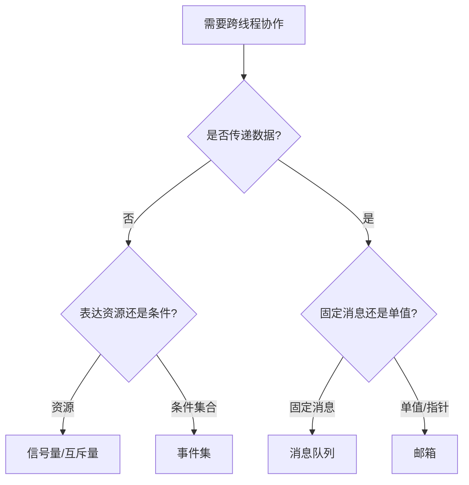
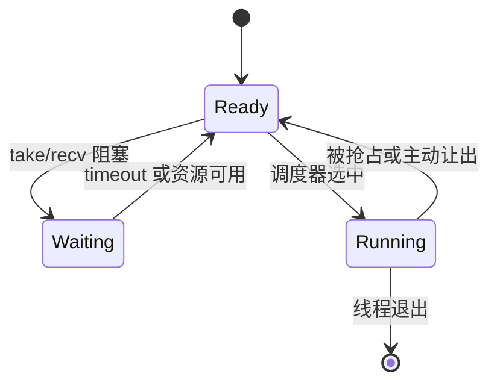

## 一句话结论

信号量和事件表达“是否有资源/条件”，互斥量保护“谁拥有资源”，消息队列和邮箱传递数据；它们都可能阻塞，但载荷、所有权、超时和 ISR 限制不同。

## 适用范围与前置知识

- 适用：RT-Thread `v5.2.2`（commit `ddf52e2cdd977f14fc04035c88672ac204aec713`）的概念和 `src/ipc.c` 对照阅读。
- 不适用：把教学抽象当作所有 RTOS 或其他 RT-Thread 版本的字段/API 保证。
- 前置：线程状态、调度点、临界区和 Cortex-M 异常上下文。

## IPC 选择流程图（Mermaid 失败时的文字降级）



## IPC 等待状态图



文字降级：线程从 Ready 进入 Running；调用可能阻塞的 IPC API 后进入 Waiting；资源到达或超时回到 Ready，最终由调度器再次选择。

文字步骤：先判断是否传数据；不传数据时区分资源与条件集合；传数据时再区分固定大小消息和单值/指针。ISR 能否调用必须以该版本 API 文档和端口上下文为准，不能凭名称猜测。

## 对比表

| 对象 | 主要语义 | 是否传数据 | 关键边界 |
| --- | --- | --- | --- |
| 信号量 | 资源计数或同步事件 | 否 | 计数、超时、唤醒顺序 |
| 互斥量 | 所有权和临界区保护 | 否 | 持有者、递归、优先级继承配置 |
| 事件 | 多个条件位组合 | 位集合 | 清除规则、等待条件 |
| 消息队列 | FIFO 固定大小消息 | 是 | 消息大小、队列满/空、拷贝语义 |
| 邮箱 | 单字或指针值传递 | 是 | 宽度和 API 语义绑定目标架构/版本 |

## 核心代码（static-reviewed，未在目标板运行）

```c
/* 伪代码：API 名称和 ISR 限制以固定版本配置为准。 */
if (rt_sem_take(resource, timeout) == RT_EOK) {
    update_shared_state();
    rt_sem_release(resource);
} else {
    record_timeout();
}
```

验证状态：`static-reviewed`；当前没有在 Cortex-M 真板运行，不标记 `hardware-tested`。调试时记录线程状态、等待对象、超时值、持有者和最后一条日志。

## 调试步骤、反例与限制

1. 先画出“线程 → 等待对象 → 持有者/生产者 → 唤醒路径”的状态图。
2. 为每次获取、释放、发送、接收记录时间戳、线程优先级和返回码。
3. 检查 ISR 是否调用了可能阻塞的 API，并核对 `v5.2.2` 的实现与配置。
4. 反例：用信号量替代互斥量保护共享结构，可能失去所有权约束和优先级继承；用消息队列传递事件但忽略队列满，也会丢失关键事实。

## 30 秒回答与展开回答

30 秒回答：先说是否传数据，再区分资源、所有权和条件集合；消息队列/邮箱是传输机制，互斥量有持有者，所有超时和 ISR 边界都要回到版本文档。

展开回答：结合线程状态和调度点解释阻塞/唤醒；记录队列容量、超时、优先级继承和错误码；用最小复现与日志回归验证，而不是把“能阻塞”当作统一答案。

递进追问：

1. 优先级反转如何出现，互斥量的优先级继承能解决哪些边界？
2. 消息队列与邮箱在固定消息大小、拷贝/指针所有权和 ISR 使用上如何取舍？

## 自测与主动回忆入口

- 自测：给出“共享资源保护”和“传递传感器样本”两个场景，分别选择 IPC，并写出超时和队列满时的处理。
- 主动回忆：合上页面，按“为什么需要—保存什么状态—谁被唤醒—是否传数据—是否允许超时—ISR 能否调用”六问比较五类对象，按忘记/困难/掌握/简单自评。

## 来源与证据边界

RT-Thread 手册和固定 commit 的 `ipc.c` 支撑实现层结论；通用 RTOS 机制不能替代版本源码。没有目标端口、配置宏和真板日志时，不声称具体时序或硬件行为。
