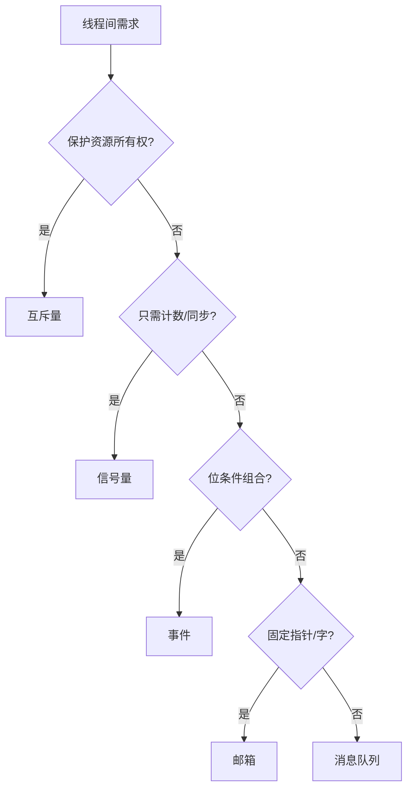

## 一句话结论

信号量表达计数或同步，互斥量保护所有权明确的共享资源，事件表达位集合，邮箱传递固定大小消息，消息队列传递有长度的数据；先说通信语义再选对象。

## 适用范围与前置知识

适用于 RT-Thread v5.2.2 IPC 源码和 API 语义。前置知识是线程阻塞/唤醒、临界区和队列；具体内存占用、优先级继承等特性以配置和版本为准。

## 选择流程图



文字降级：资源所有权用互斥量，计数同步用信号量，位条件用事件，固定大小消息用邮箱，变长/批量消息用消息队列。

## 核心代码

```c
if (rt_mutex_take(&bus_lock, RT_WAITING_FOREVER) == RT_EOK) {
    transfer_frame(frame, length);
    rt_mutex_release(&bus_lock);
}
```

所有权对象要在同一线程成对获取/释放；错误路径也必须释放。队列写入时要定义满队列策略：阻塞、丢弃旧消息或返回错误。

## 调试方法

1. 为每次 take/send/receive 记录对象名、线程、返回值、等待时长和队列水位。
2. 检查 ISR 是否调用了允许在中断上下文使用的 API，禁止在 ISR 中无限等待。
3. 用资源忙、队列满、超时和线程退出四种场景测试错误路径。
4. 对比互斥量和二值信号量的所有权、优先级反转和递归行为，不混用概念。

反例：用信号量保护需要所有权的资源却允许任意线程释放；在消息队列满时静默覆盖；在 ISR 中调用永久阻塞 API。

## 30 秒回答与展开回答

30 秒回答：IPC 选择取决于语义，不是“哪个 API 顺手”。互斥量保护有所有权的资源，信号量做计数/同步，事件表达位条件，邮箱和消息队列负责传递消息。调试关注返回值、等待上下文和水位。

展开回答：先画生产者、消费者和共享资源，再决定是否需要所有权、计数或数据传输。每个阻塞点都要有超时和错误策略，ISR 与线程可用接口边界要按 RT-Thread 版本核对。

## 递进追问

1. 为什么“二值信号量替代互斥量”可能引入优先级反转或错误释放？
2. 消息队列满时如何选择阻塞、丢弃和背压，并用什么指标证明选择合理？

## 自测与主动回忆

- 自测：给出“保护 SPI 总线、通知采样完成、传递传感器帧、等待多个条件”四个场景的 IPC 选择和理由。
- 主动回忆：不用看页面说出五种 IPC 各自传递的是什么。

## 来源和证据边界

IPC API 和实现边界以 RT-Thread v5.2.2 `ipc.c` 与线程管理手册为准；优先级继承、内存布局和 ISR 限制需结合具体配置核验。
