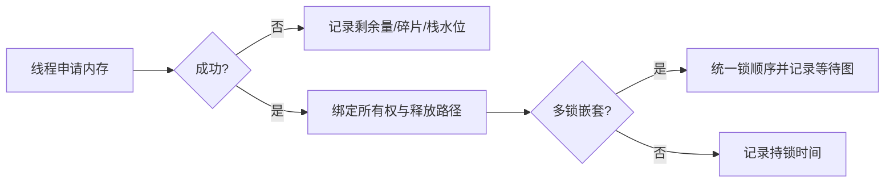

## 一句话结论

RTOS 内存问题要同时看分配器、线程栈和对象生命周期；锁问题要画等待图并记录持锁时间，优先级反转和死锁不能靠增加延时解决。

## 适用范围与前置知识

适用于 RT-Thread v5.2.2 内存管理和 IPC 阅读路径。前置知识是线程优先级、互斥量、临界区和 C 生命周期；具体分配器由配置决定，不把某一种算法写成唯一实现。

## 故障关系图



文字降级：每次分配都要有所有权和释放路径；锁要规定全局顺序，监测等待时间和栈水位。

## 核心代码与排查表

```c
void *buffer = rt_malloc(size);
if (buffer == RT_NULL) {
    log_memory_failure(size, rt_memory_get_info());
    return -ENOMEM;
}
/* 使用完成后由明确的拥有者释放一次。 */
rt_free(buffer);
```

排查时保留：当前/最高水位、分配大小、失败次数、线程栈余量、锁持有者、等待者和锁顺序。API 名称与返回值以目标版本头文件为准。

## 调试方法

1. 启用内存统计或钩子，记录分配调用点和释放调用点，发现双重释放和泄漏。
2. 用固定块内存池处理固定大小消息，观察碎片是否下降；不能直接假定效果。
3. 为锁建立有向等待图，出现环即为死锁候选；记录优先级和持锁时长识别反转。
4. 设置锁获取超时和看门狗诊断路径，超时后保存现场而不是继续盲等。

反例：在线程栈很小的情况下递归或放置大数组；多个锁按不同顺序获取；用 `rt_thread_mdelay` 试图“修复”锁竞争。

## 30 秒回答与展开回答

30 秒回答：内存排查看分配器、栈水位和对象所有权，锁排查看等待图、顺序、持有时间和优先级。先采集证据，再调整池大小、锁粒度或调度策略。

展开回答：RT-Thread 支持多种内存管理配置，必须绑定版本和宏。优先级反转是高优先级线程等待低优先级持锁者的现象，是否有继承机制要查具体互斥量实现，不能用二值信号量类比。

## 递进追问

1. 如何用最小日志区分内存泄漏、碎片化和线程栈溢出？
2. 如果锁顺序无法统一，如何用超时、分层锁或消息传递降低死锁风险？

## 自测与主动回忆

- 自测：画出三个线程、两把锁的等待图，给出一个死锁环和一个统一锁顺序方案。
- 主动回忆：复述“分配器、栈水位、所有权、锁顺序、等待图”五个排查点。

## 来源和证据边界

RT-Thread 内存管理、IPC 和线程语义以 v5.2.2 源码/手册为准；统计钩子、优先级继承和分配器细节需结合工程配置及实际日志确认。
