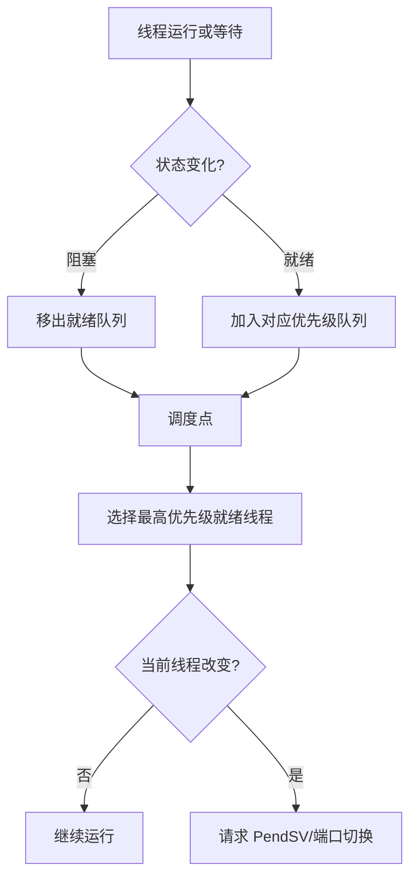

## 固定分层

RTOS 通用机制讨论可抢占、优先级和阻塞；RT-Thread 实现讨论对象模型、公共调度代码和 UP 端口；Cortex-M 实现讨论 SysTick/PendSV；具体 STM32/GD32 料号另行核验。

## 阅读顺序

先看线程状态和就绪队列，再追踪调度点，最后阅读 RT-Thread v5.2.2 对应 commit 的 `scheduler_comm.c`、`scheduler_up.c` 和 Cortex-M 上下文入口；其他版本应重新核对文件组织和端口实现。

## 练习

画出高优先级线程解除阻塞到 PendSV 执行的调用链，并标记线程态与异常态边界。

## 一句话结论

RT-Thread 调度可以按“线程状态变化 → 就绪队列更新 → 选择最高优先级线程 → 在合适的调度点切换”来推理；队列结构、位图和 PendSV 汇编必须绑定具体版本和端口。

## 适用范围与前置知识

- 适用：RT-Thread v5.2.2（commit `ddf52e2cdd977f14fc04035c88672ac204aec713`）的通用调度阅读路径。
- 不适用：把教学模型外推为其他 RTOS、其他 RT-Thread 版本或任意 Cortex-M 端口的寄存器行为。
- 前置：线程状态、优先级、阻塞/唤醒和 Cortex-M 异常入口。

## 调度流程图（Mermaid 失败时的文字降级）



文字步骤：线程阻塞或就绪 → 更新队列 → 到达调度点 → 选择线程 → 若发生变化则进入端口上下文切换。具体调度点和中断屏蔽范围回到源码确认。

## 核心代码、日志与调试步骤

```c
/* 伪代码：函数名以固定 RT-Thread 版本源码为准。 */
if (thread->state == THREAD_READY) {
    ready_queue_insert(thread->priority, thread);
}
next = scheduler_select_highest_ready();
if (next != current) {
    request_pendsv();
}
```

调试日志至少记录：`tick`、当前线程、候选线程、优先级、阻塞对象、调度原因和是否进入 PendSV。未在 v5.2.2 真板运行，不标记为实测时序。

1. 固定 commit、BSP 配置、CPU 端口和编译器，再追踪一次阻塞/唤醒调用链。
2. 对比调度前后的就绪队列和线程状态，确认是否发生优先级抢占。
3. 在 PendSV 入口/出口记录最小事件，避免在临界区内大量打印。
4. 反例：只看到“高优先级线程先运行”就断言所有调度器都有同样的时间片、位图或公平性。

## 30 秒回答与展开回答

30 秒回答：调度先处理线程状态和就绪队列，再在调度点选择最高优先级线程，发生变化时由端口完成上下文切换；实现细节必须绑定 RT-Thread 版本和 CPU port。

展开回答：先讲通用抢占模型，再读 `scheduler_comm.c`、`scheduler_up.c` 和端口汇编，最后用线程状态、队列和 PendSV 日志验证，不把 API 名称当作源码证据。

递进追问：

1. 阻塞线程被唤醒时，哪个步骤决定是否触发抢占？
2. PendSV 与 SysTick 在调度链中的职责如何分开，临界区又如何影响观察结果？

## 自测与主动回忆入口

- 自测：画出一个高优先级线程解除阻塞的状态图，标记队列变化、调度点和 PendSV 边界。
- 主动回忆：合上页面复述“状态—队列—选择—切换—日志”五点，并按能否指出版本边界自评。

## 来源与证据边界

RT-Thread 线程管理手册和固定 commit 的调度源码支撑本课；当前没有在具体板卡上运行或测量调度延迟，端口和配置结论仍需人工核对。
