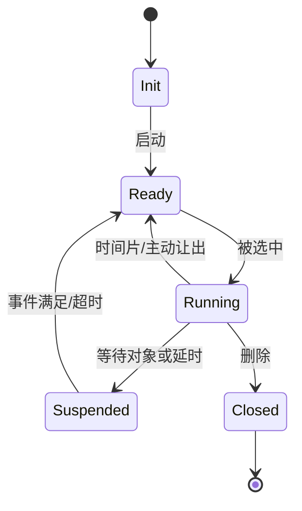

## 一句话结论

RT-Thread 线程在初始化、就绪、运行、挂起和关闭之间转换，Tick 负责时间推进和超时检查；软件定时器回调是否在中断上下文执行取决于配置，必须按版本和配置核对。

## 适用范围与前置知识

适用于 RT-Thread v5.2.2 通用内核阅读路径，端口和配置差异以对应 commit 为准。前置知识是优先级调度、临界区和 IPC 阻塞。

## 状态图



文字降级：线程创建后进入就绪，调度器选中才运行；等待对象或延时会阻塞，条件满足或超时后回到就绪。

## 核心代码与调试日志

```c
rt_thread_mdelay(10);       /* 进入延时等待，具体 Tick 换算由配置决定 */
rt_sem_take(&ready, 100);   /* 等待对象，超时值按 RT-Thread API 约定 */
```

调试时记录 `tick`、线程名、状态、等待对象、超时 tick 和唤醒原因。不要在日志中把 tick 直接写成毫秒，除非已经记录了 `RT_TICK_PER_SECOND`。

## 调试方法

1. 固定 RT-Thread commit 和 `RT_TICK_PER_SECOND`，在状态转换点记录时间戳。
2. 区分线程主动延时、等待对象和被抢占：三者的调用链和就绪队列变化不同。
3. 检查软件定时器模式和回调执行上下文，回调中只做短操作或投递事件。
4. 观察 Tick 丢失、临界区过长和系统 tick 溢出边界，使用长时间回归验证。

反例：把 `rt_thread_mdelay(10)` 当成精确 10 ms；在定时器回调中执行阻塞 IO；只看线程名不看等待对象。

## 30 秒回答与展开回答

30 秒回答：线程状态决定是否进入就绪队列，Tick 推进延时和超时，调度器在调度点选择线程。软件定时器的回调上下文由配置决定，调试必须记录 tick、状态和唤醒原因。

展开回答：我会先固定版本和 tick 频率，再沿状态转换、就绪队列和调度点验证。任何毫秒结论都要说明 tick 换算和测量误差，不能从 API 名称推断精度。

## 递进追问

1. 系统 tick 频率提高后，调度开销、定时精度和溢出周期如何变化？
2. 如何证明线程是被信号量唤醒，而不是刚好时间片轮转获得 CPU？

## 自测与主动回忆

- 自测：为“创建、就绪、运行、等待、超时唤醒、删除”六个节点各写一个可观察证据。
- 主动回忆：复述线程状态、Tick、超时和定时器回调上下文的关系。

## 来源和证据边界

线程管理、调度和定时器实现以 RT-Thread v5.2.2 手册与固定 commit 源码为准；具体 BSP 的 tick 中断和定时器配置需单独核验。
