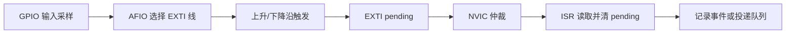

## 一句话结论

STM32F103 的 GPIO 中断要沿“GPIO 输入 → AFIO 线路映射 → EXTI 边沿 → NVIC 优先级 → ISR 清 pending”验证，按键消抖属于应用层策略，不是 NVIC 自动完成的功能。

## 适用范围与前置知识

目标是 STM32F103C8T6 和 Cortex-M3，寄存器位以 RM0008 对应章节为准；未指定具体开发板，不推断按键引脚。前置知识是向量表、C 位操作和中断现场。

## 中断链路图



文字降级：先确认引脚映射和边沿，再确认 pending 与 NVIC，ISR 只完成取证和投递，长耗时消抖放在线程或定时器中。

## 核心代码（寄存器名需按工程头文件核对）

```c
static volatile uint32_t button_events;

void EXTI0_IRQHandler(void)
{
    if (exti_pending_line0()) {
        exti_clear_pending_line0();
        button_events++;
    }
}
```

上面是接口边界示例，不声称这些辅助函数是 ST 标准库固定 API。实际工程要核对 GPIO 时钟、AFIO 配置、EXTI 中断号和 NVIC 分组。

## 调试方法

1. 先用示波器确认引脚确实有边沿，再读 GPIO 输入采样值。
2. 分别记录 EXTI pending、NVIC enable/active/pending 和 ISR 计数。
3. 用单次按键和连续抖动波形区分硬件噪声、映射错误和软件重复触发。
4. 在 ISR 中只清 pending、记录时间戳和投递事件，消抖用定时器或线程完成。

反例：在 ISR 里 `delay_ms`；清错 EXTI pending 位；只开 NVIC 不配置 AFIO/边沿触发；把按键电平变化直接当成一次点击。

## 30 秒回答与展开回答

30 秒回答：GPIO 中断不是只开 NVIC。要检查输入模式、AFIO 到 EXTI 的映射、触发边沿、EXTI pending 和 NVIC 状态，ISR 清 pending 后快速投递事件，消抖另行处理。

展开回答：我会先锁定 F103C8T6 的具体引脚和 RM0008 配置，再用波形、寄存器状态和 ISR 计数对齐证据。中断优先级只能决定仲裁，不能替代正确映射和电气消抖。

## 递进追问

1. 多个 EXTI 线共享一个 IRQ 时，如何保证只处理真正 pending 的线路？
2. 中断触发后马上读 GPIO 电平，为什么可能无法判断边沿方向？

## 自测与主动回忆

- 自测：画出按键从引脚变化到线程收到事件的七个节点，并在每个节点写一个观察量。
- 主动回忆：复述“输入、映射、边沿、pending、NVIC、ISR、消抖”的顺序。

## 来源和证据边界

STM32F1 外设映射和 EXTI/NVIC 配置以 RM0008、STM32F103C8T6 数据手册及工程头文件为准；本课不提供未核对的板级引脚或寄存器地址。
