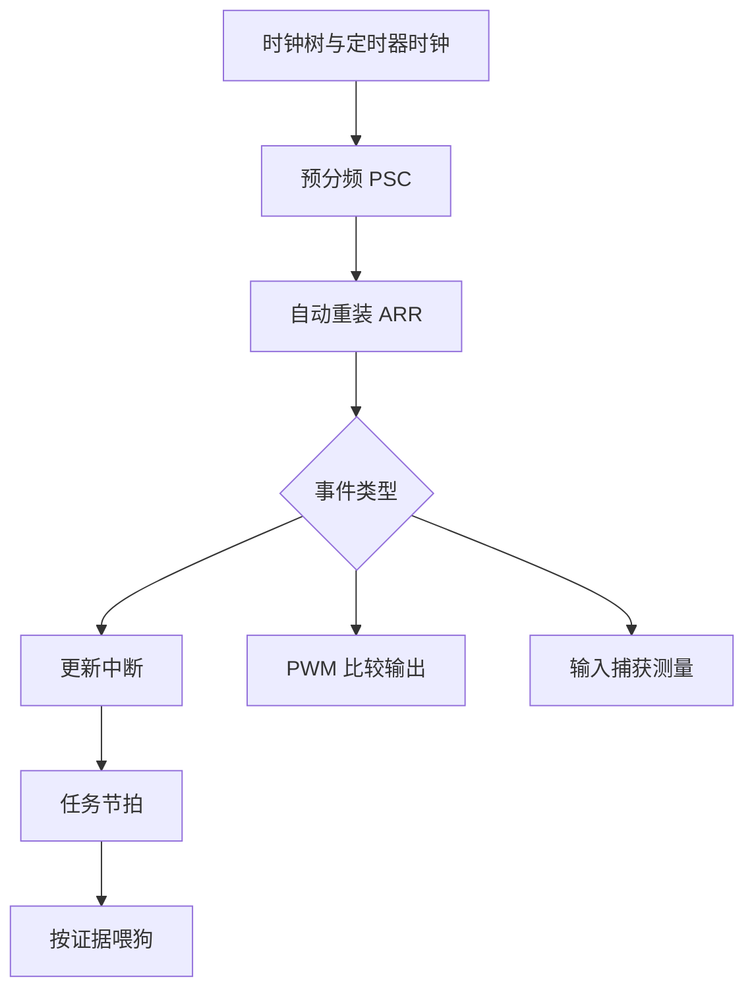

## 一句话结论

定时器负责计数和事件，PWM 是比较输出的一种应用，看门狗负责在软件失去进展时复位；三者的时钟源、分频和复位证据必须分开核对。

## 适用范围与前置知识

目标是 STM32F103C8T6 的通用定时器和看门狗概念。前置知识是时钟树、寄存器位操作和中断；具体 APB 分频导致的定时器时钟倍频要回到 RM0008 时钟章节计算。

## 周期任务流程图



文字降级：先算定时器输入时钟，再用 PSC/ARR 得到周期；PWM、捕获和更新中断共享计数器但用途不同，喂狗只能发生在系统确认仍然健康之后。

## 核心计算与代码

```c
/* 仅表达计算关系，实际寄存器/库 API 以 RM0008 和工程为准。 */
timer_hz = timer_input_hz / ((psc + 1U) * (arr + 1U));
duty = (float)compare / (float)(arr + 1U);
```

看门狗超时值还受独立低速时钟和分频配置影响。不要把“程序定时调用喂狗”当作健康检查，建议由关键任务汇总心跳后再喂狗。

## 调试方法

1. 用示波器测 PWM 频率和占空比，与时钟树计算结果对照。
2. 记录更新中断时间戳、捕获值和溢出次数，区分计数器溢出与输入信号异常。
3. 故意阻塞关键任务，验证看门狗是否复位并保存复位原因；未实际运行时不声称复位成功。
4. 检查 APB 分频、预分频寄存器影子更新和自动重装生效时机。

反例：把 CPU 主频直接当定时器时钟；只改 ARR 不重新计算 PSC；在所有路径无条件喂狗掩盖死锁。

## 30 秒回答与展开回答

30 秒回答：定时器周期由输入时钟、PSC 和 ARR 决定，PWM 通过比较值控制占空比，输入捕获读取边沿间隔，看门狗在系统失去进展时复位。调试要用波形、寄存器和复位原因互相验证。

展开回答：我会先固定 F103 时钟树和目标定时器，再计算周期并测量输出。看门狗应由健康监测驱动，记录复位标志后才能判断是超时还是其他复位源。

## 递进追问

1. 为什么修改 PWM 周期时可能需要同时处理预装载寄存器和更新事件？
2. 如何用输入捕获测量低频信号而避免计数器溢出造成误判？

## 自测与主动回忆

- 自测：给定输入时钟、PSC、ARR，写出频率公式，并列出测量结果不符时的四个检查点。
- 主动回忆：解释“计数、比较、捕获、更新、健康喂狗”各自的职责。

## 来源和证据边界

定时器、PWM、IWDG/WWDG 和时钟配置以 STM32F1 RM0008 及具体数据手册为准；没有工程时钟树和示波器日志，不给出具体频率结论。
