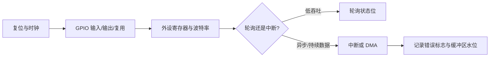

## 一句话结论

STM32F103C8T6 的外设学习要沿“时钟 → GPIO 复用 → 外设配置 → 中断/DMA → 现场验证”链路展开，不能只背 API 名称。

## 适用范围与前置知识

目标是 STM32F103C8T6（Cortex-M3），外设寄存器以 ST RM0008 与对应数据手册为准。前置知识是 C 位操作、中断入口、启动文件和链接脚本；没有指定板卡时不推断引脚连接。

## 外设初始化流程图



文字降级：先开时钟，再配引脚和外设，最后决定轮询、中断或 DMA，并为每条路径保留错误和溢出证据。

## 核心代码与边界

```c
static void uart_rx_consume(const uint8_t *data, size_t length)
{
    if (data == NULL || length == 0) return;
    /* 真实工程应在 ISR/DMA 回调与线程之间使用明确的并发协议。 */
}
```

初始化顺序的概念伪代码：`enable_clock()` → `configure_gpio_af()` → `configure_uart()` → `enable_irq_or_dma()`。函数名不是 STM32 标准库或 HAL 的固定接口，不能据此推断寄存器地址。

## 调试方法

1. 无输出：先核对时钟是否开启、GPIO 是否复用、波特率计算输入时钟是否正确。
2. 丢字节：记录 RXNE/ORE、DMA 计数器、环形缓冲区读写指针和中断屏蔽时间。
3. ADC/DMA 异常：记录采样触发源、DMA 通道映射、数据宽度和缓存一致性边界。
4. 定时器频率不符：从 APB 分频和定时器时钟来源重新计算，不从打印间隔倒推结论。

反例：把另一型号 STM32 的 DMA 通道表直接复制到 F103；只看 GPIO 电平正常就认为 UART 复用和时钟配置正确。

## 30 秒回答与展开回答

30 秒回答：STM32F103 外设初始化不是“调用一个初始化函数”，而是时钟、引脚复用、寄存器参数和数据搬运方式的组合。遇到问题要同时保留状态位、时钟配置、缓冲区和中断现场。

展开回答：先确定芯片型号和 RM0008 章节，再画数据流；短事务可以轮询，持续数据通常考虑中断/DMA，但要说明并发和溢出策略。所有波特率、通道和引脚结论都要回到具体手册和工程配置。

## 递进追问

1. UART 中断接收偶发丢字节，你会如何区分 ORE、环形缓冲区满和中断优先级问题？
2. ADC DMA 数据看起来“偶尔跳变”，哪些证据能证明是采样触发或数据宽度配置，而不是传感器噪声？

## 自测与主动回忆

- 自测：按顺序写出外设从复位到第一次可靠收发的五个步骤，并在每一步标一个可观察证据。
- 主动回忆：合上页面解释“时钟、复用、外设、搬运、错误标志”五个词如何串成一条 UART 调试链。

## 来源和证据边界

本课绑定 STM32F103C8T6 与 RM0008 文档入口，Cortex-M 异常只引用 Arm 通用指南。未指定板卡原理图、晶振和工程配置时，不给出具体引脚、波特率或 DMA 通道结论。
